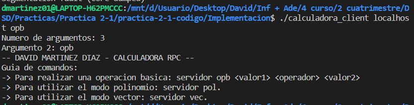
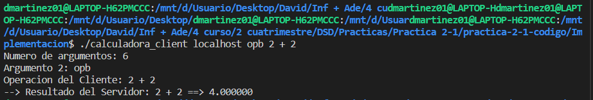
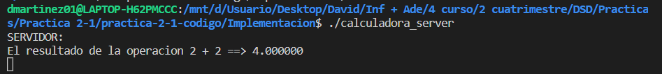
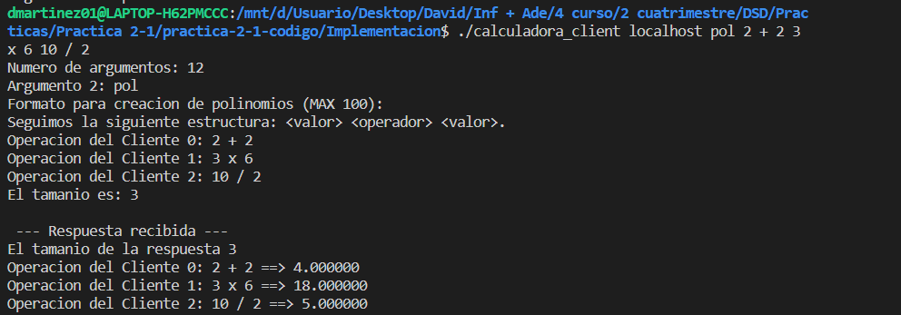
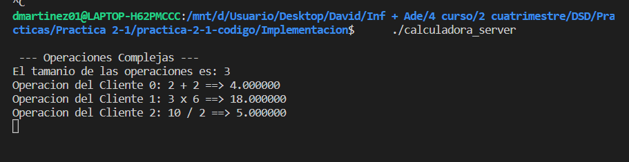
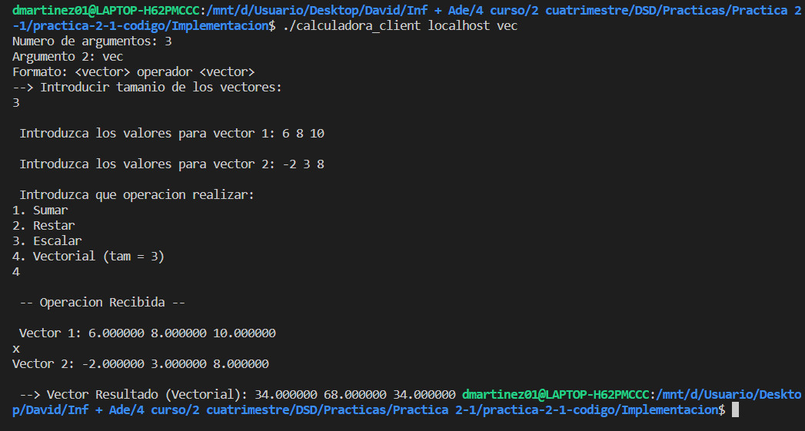
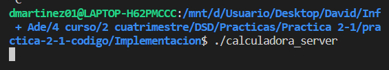

<h1> Desarrollo de Sistemas Distribuidos </h1>

<h2> Práctica 2: Sun RPC </h2>

*David Martinez Diaz*

<h3> 1. Breve Introduccion: </h3>

En esta práctica, se nos ha encomendado la tarea de desarrollar una calculadora distribuida utilizando Sun RPC. 
 La calculadora será capaz de realizar varias operaciones, incluyendo sumas, restas, multiplicaciones y divisiones, tanto de números simples como de vectores. En el caso de los vectores, podemos realizar operaciones entre dos vectores, haciendo la operación correspondiente posición por posición.

---

<h3> 2. Explicacion de las variables: </h3>

En primer lugar, debemos comentar el archivo calculadora.x, el cual es la base para la utilizacion de Sun RPC, aqui se definen los datos y la interfaz necesaria para poder acceder remotamente. En mi caso se han definido las siguientes:

* **Operacion**, se trata de un struct que esta compuesto por 3 valores, "a" y "b" son enteros y luego "operador" es un char, la idea era crear lo siguiente:
  * [a] [operador] [b]
* **resVec**, es un vector de doubles, el cual utilizare para realizar las operaciones entre vectores, ya sea la suma, resta o el producto vectorial. Tiene definido los <> para declarar que un array sin un tamaño definido, y que el tamaño que tendra lo defeniremos en la clase cliente segun el numero de valores que se hayan pasado por parametro.
* **vOper**, es un vector de operaciones, para poder realizar varias operaciones a la vez, yo los llamo polinomios pero realmente es una cadena de operaciones simples, las cuales se van almacenando en un vector "resVec".

Podemos decir ademas, que Sun RPC convierte estos vectores en un tipo de estructura que contiene tanto el vector en si (_val), como ademas una variable entera que indica el tamaño de esto (_len), lo que es bastante conveniente para operar con ellos.

Por otro lado, me he creado dos uniones, que seran los que devuelva el servidor, uno para operacione simples y otro para cuando haya que devolver un vector de resultados. Ambas tienen un argumento de error, para que cuando haya un fallo se termine el programa:

* **calc_res**, si no hay un error tiene una variable de tipo double llamada "resultado".
* **calc_res_vec**, si no hay un error tiene una variable de tipo resVec llamada "resultado" (recordemos que es vector de doubles).

Leyendo la documentacion proporcionada, estas uniones se transforman en lenguaje C en structs, con un campo de union pero con los siguientes nombres:
  * calc_res_u y calc_res_vec_u

---

<h3> 2. Explicacion de las funciones y programas: </h3>

Me he creado 3 programas distintos, necesarios para cada tipo de operacion, ya sea simple, compuesta o por vectores, empezando inicialmente en "0x20000155" y subiendo respectivamente, cada uno con su correspondiente version igual a 1, y las funciones van identificadas desde el 1 hacia arriba:

```c
program OP_BASICA {
	version DIRVER {
		calc_res SUMAR(Operacion) = 1;
		calc_res RESTAR(Operacion) = 2;
		calc_res MULTIPLICAR(Operacion) = 3;
		calc_res DIVIDIR(Operacion) = 4;
	} =1;
} = 0x20000155;

program OP_COMPLEJA {
	version DIRVER {
		calc_res_vec OP_COMPLEJA_SERVER(vOper) = 1;
		
	} =1;
} = 0x20000156;

program OP_VECTORES {
	version DIRVER {
		calc_res_vec OP_VECTORES_SERVER(resVec, resVec, int) = 1;
		
	} =1;
} = 0x20000157;

```


En cuanto al archivo **calculadora_client.c**, tengo declaradas distintas variables segun los datos que me vayan a pasar por parametros en la terminal. 

En el main se filtra toda la informacion necesaria para poder realizar las opareciones y asi poder llamar a las funciones correspondientes del servidor.

Para ello se sigue esta estructura: 



Segun el tipo de operacion a realizar, tengo unas variables u otras, por ejemplo, para realizar una **operación basica** ("opb"), me declaro una variable de tipo Operacion y almaceno los datos pasados por la terminal en esta, y se lo paso paso a la función "op_basica_1", donde le paso por parametro dicha Operacion y me creo el cliente con la función "clnt_create".

En esta funcion, a traves de un switch compruebo de que tipo de operacion se trata (suma, resta, multiplacion o resta) para saber a que funcion debo llamar del servidor.

Si quiero realizar varias operaciones basicas, lo tengo definido como **polinomio** ("pol"), y para ello me creo un vOperaciones donde voy almacenando todos los datos que posteriormente se lo pasare a la función "op_compleja_1". Y directamente le paso dicha estructura al servidor y que este interprete toda la información.

Por ultimo, tenemos las **operaciones de vectores** ("vec"), para este caso, no dejo que me pase por parametros los vectores, sino una vez seleccionado esta opcion realizo una serie de scanf() para recibirlos y luego pregunto por la operacion a realizar. Para almacenar dicho datos tengo dos vectores resVec y un int "opcion" para saber que operacion realizar y que se la pasaré a la funcion "op_vectores_1".

Y por otro lado tenemos **calculadora_server.c**, aqui es donde estan definidas cada una de las operaciones a realizar, segun las cabeceras del archivo "calculadora.h".

* Para las operaciones basicas (SUMAR, RESTAR, MULTIPLICAR Y DIVIDIR), le llega por parametro un struct de Operacion con el cual consigo el valor de "a" y el valor de "b", donde posteriormente almacena el resultado en un "**result.calc_res_u.resultado**".
* Para las otras operaciones (OP_COMPLEJA y OP_VECTORES), le llegan por parametros vectores y cada uno realizara sus respectivas operaciones y las almacenaran en "**result.calc_res_vec_u.resultado.resVec_val**".

---

<h3> 3. Ejemplos de ejecucion </h3>


Para el primer ejemplo vamos a realizar una operacion basica sencilla, y mostraré las capturas de pantalla tanto del servidor como del cliente:

* **Cliente:**
  


* **Servidor:**
  



Ahora vamos a realizar varias operaciones a la vez, y mostraré las capturas de pantalla tanto del servidor como del cliente:

* **Cliente:**
  


* **Servidor:**
  



Ahora vamos una operacion con vectores, y mostraré las capturas de pantalla tanto del servidor como del cliente:

* **Cliente:**
  


* **Servidor:**
  



