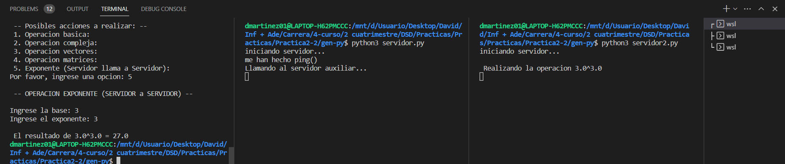

<h1> Desarrollo de Sistemas Distribuidos </h1>

<h2> Práctica 2 (RPC): Calculadora en Apache Thrift </h2>

*David Martinez Diaz*

<h3> 1. Breve Introduccion: </h3>

En esta segunda parte de la practica 2, se nos pide realizar otra vez una calculadora utilizando esta vez otra tecnologia diferente llamada Apache Thrift. Dicha tecnologia se basa en IDL, para poder crear clientes y servidores, que tiene la posibilidad de multilenguajes. 
Por eso, que una de las opciones de la aplicacion es tener la posibilidad de hacerlo en diferentes lenguaje ya sea java o python:

En mi caso, he utilizado solamente el lenguaje de Python, ya que al poseer una gran variedad y potentes librerias, resulta mucho mas facil operar con vectores y matrices, utilizando en este caso la libreria numpy.

La calculadora es capaz de realizar operaciones sencillas, varias operaciones a la vez y operaciones con vectores y matrices.


---

<h3> 2. Explicacion de la solucion: </h3>

En primer lugar nos encontramos con el archivo **"calculadora.thirft"**, que nos permite definir una interfaz, los datos y rutinas a los que se van a poder acceder de manera remota. Este esta escrito en su propio lenguaje de Apache Thrift.

Unicamente me he definido una estructura para el cliente y servidor:

```c
struct Operacion {

   1: required double a ;
   2: required string operador ;
   3: required double b ;
}
```

Esta estructura es la base para realizar cualquier operacion, donde luego lo utilizare para crearme un array de Operaciones, cuando tenga que manda varias operaciones a la vez. 

Los campos "a" y "b" son variables de tipo double, que seran las variables con las realizaremos las operaciones y luego el operador es una variable de tipo String donde se almacenara el tipo de operacion a realizar, por ejemplo, cuando se quiera sumar se representara tal que asi: "+".

Todos estos campos son required, es decir, son obligatorios, por lo que cuando se cree un objeto de este tipo habra que darles valores en su constructor, es decir, no se podran crear constructores vacios.

---

Luego debemos definir el programa con sus respectivas funciones, la cual se llama Calculadora, como podemos ver aqui:

```c
service Calculadora{

   void ping(),

   double suma(1:double num1, 2:double num2),
   double resta(1:double num1, 2:double num2),
   double multiplicacion(1:double num1, 2:double num2),
   double division(1:double num1, 2:double num2),

   list<double> operacionCompuesta(1:list<Operacion> lista),

   list<double> operacionVectores(1:list<double> vec1, 2:list<double> vec2, 3:i32 opcion),

   list<list<double>> operacionMatrices(1:list<list<double>> mat1, 2:list<list<double>> mat2, 3:i32 opcion),

   double exponente(1:double num1, 2:double num2),
}
```

Como podemos observar, las operaciones basicas (SUMA,RESTA,MULTIPLICACION y DIVISION) devuelven un double y reciben por parametro dos doubles respectivos a "a" y "b".

En cuanto a las operacionesCompuestas y a operacionVectores, estas devuelve un array de doubles, el primero de estos contiene los resultados de todas las operaciones realizas mientras que el segundo devuelve un nuevo vector resultado aunque si es el caso del producto escalar el tamaño del array sera 1.

Para la operacionMatrices, devolvemos una lista de listas de doubles, que segun su logica es como si se tratase de una matriz, donde le pasamos por parametro dos matrices las cuales se utilizaran para operar y un entero que indique la operacion a realizar, ya sea sumar, restar, multiplicar...

Por ultimo, tenemos la operacion exponente(), que tiene como parametros dos doubles que seran la base y el exponente, donde el resultado que se devolvera es un double.

---

Si pasamos al archivo **"cliente.py"**, podemos ver que tiene una estructura muy parecida a la de la parte 1 de esta práctica, pero con ciertas particularidades propias de Apache Thrift.

Al principio de ese, se importan todas las librerias necesarias para poder realizar cualquier conexion con el servidor y para poder operar con cualquier tipo de dato.

Entonces se almacen en variables la informacion necesaria al canal de transporte (del tipo buffered, explicado en clase), el protocolo para pasar la informacion y el cliente. Entonces una vez obtenido todos estos datos, ya se puede abrir el canal entre el servidor y el cliente.

Siempre que se quiera acceder al servidor, necesitaremos utilizar a la variable cliente que tendra todos los datos necesarios para poder realizar dicha conexion, un ejemplo de esto:

```c
print("-- Hacemos ping al server -- \n")
client.ping()
```

--- 

Con esto podemos comprobar que la conexion es correcta y dar comienzo con la calculadora interactiva:

* La calculadora se basa en esperar a que el cliente indique que accion quiere realizar ya sea una operacion basica, compuesta o utilizar vectores y matrices.
* Una vez tenemos la opcion a realizar, a traves de unos "ifs" podremos filtrar como queremos actuar y que variables utilizar y llamar a la funcion especifica que queremos realizar.
* Dicha llamada a la funcion estara igualada a una variable que almacenara el resultado de dicha operacion y donde posteriormente mostraremos por la pantalla.

---

Por otro lado, tenemos el archivo **"servidor.py"**, que me permitira definir el comportamiento de las funciones previamente definidas. 

Para las primeras funciones, que son las mas basicas, se le pasan por parametro las valores que se quieren operar. Sin embargo hay que realizar una serie de especificaciones para las demas funciones:

* Para la funcion "operacionCompuesta", se le pasa por parametro un array de structs del tipo Operacion, por lo que recorreremos dicha lista para saber de que tipo de operacion se trata leyendo la variable operador de esta, y vamos almacenando cada resultado en un array llamado **"lista_operaciones"** que posteriormente devolveremos en el return.
* Para la funcion "operacionVectores", se le pasa por parametro ambos vectores y la opcion a realizar, para este caso se utiliza la libreria numpy que nos permitira hacer operaciones con vectores de una manera muy sencilla (ADD, SUBSTRACT, CROSS Y DOT).
* Para la funcion "operacionMatrices", tambien he utilizado la libreria numpy que me facilita todo tipos de operaciones para las matrices (ADD, SUBSTRACT Y MATMUL).
* Por ultimo, para la operacion exponente, el servidor va a establecer una conexion como hemos hecho con el cliente posteriormente pero ahora con el servidor auxiliar pero con el **puerto "9091"** y este al final devolvera un double con el resultado.

Ademas el servidor podemos diferenciarlo en dos partes:
* La primera de ellas es el **handler**, donde se definen todas las funciones de la calculadora que hemos explicado previamente y son las que llamará el cliente.
* Y por otro lado el **main**, donde se iniciara dicho servidor, creandose un objeto handler, se le asocia un procesador y se crea el metodo de transporte. Se especifica que puerte y el cliente, a diferencia de SUN RPC, Thrift no tiene binding automatico. Finalmente se inica el servidor con los parametros que hemos indicado y se queda activo permanentemente hasta que se apague.


---
---

<h3> 3. Compilacion y ejecucion: </h3>

Primero de todo, debemos crearnos un archivo llamado **"calculadora.thrift"** y una vez hayamos declarado tanto las estructuras, funciones y el programa podemos empezar a compilarlo ejecutando este comando:

```
thrift -gen py calculadora.thrift
```
Esto nos creara una carpeta llamada **gen-py** que contendra todo los archivos relevante para poder realizar las conexiones, aqui deberemos incluir nuestros archivos **servidor.py** y **cliente.py**.

Una vez tengamos esta estructura, ya seremos capaces de ejecutar ambos cliente y servidor y realizar la respectiva conexion entre ambos:

* El primer ejemplo de ejecucion va a ser una operacion basica, donde veremos ambas partes tanto cliente como servidor:


* El segundo ejemplo, sera la operacion compuesta donde pasaremos varias al servidor y nos devolvera el resultado de todas estas:


* Como tercer ejemplo tenemos una operacion con vectores, donde como se puede ver los elementos se separan con comas:


* Tenemos una operacion con matrices, donde habrá que indica el tamaño de filas y columnas e ir introduciendo los datos de uno en uno:
  


* Y por ultimo, tenemos la operacion exponente(), el cual se encargara de llamar al servidor, y este a su vez llamara a un servidor auxiliar para poder realizar la operacion. Adjunto captura de los 2 servidores y el cliente:

