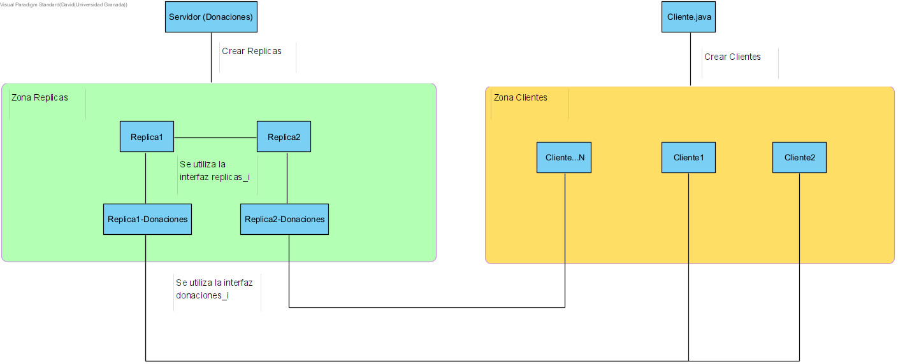

<h1> Desarrollo de Sistemas Distribuidos </h1>

<h2> Práctica 3: Ejemplos Java RMI </h2>

*David Martinez Diaz*

<h3> 1. Breve Introduccion: </h3>

En esta primera parte de la practica 3, se nos pide analizar los ejemplos propuestos y comentar cual es la funcion de cada uno de ellos, escritos en lenguaje Java utilizando RMI.


---

**<h3> Ejemplo 1: </h3>**

En primer lugar, podemos comentar el archivo "**server.policy**", el cual nos permitirá ejecutar el cliente y el servidor con todos los permisos, ya que sin estos permisos saltaría un error de excepción, donde posteriormente indicaremos en nuestro script:

```java
grant codeBase "file:./" {
    permission java.security.AllPermission;
};
```
Luego debemos irnos al fichero **"Ejemplo_I.java"**, donde se define la **interfaz remota**, es decir, para ello se hace uso de las clases/librerias "Remote" y "UnicastRemoteObject" los cuales se utilizan para definir los objetos remotos para java RMI.

* En **Ejemplo_I.java**, es la interfaz remota y donde se declaran los metodos, extendiendo la clase Remote.
* Por otro lado tenemos **Ejemplo.java**, los cuales define esos metodos.

En este caso, solo se define un metodo, el metodo **"escribirMensaje()**, que imprime la hebra que lo ha llamado y si es la hebra 0 duerme 5 segundos.

```java
System.out.println("Recibida peticion de proceso: " + id_proceso);
        if (id_proceso == 0) {
            try {
                System.out.println("Empezamos a dormir");
                Thread.sleep(5000);
                System.out.println("Terminamos de dormir");
            } catch (Exception e) {
                System.err.println("Ejemplo exception:");
                e.printStackTrace();
            }
        }
        System.out.println("\nHebra " + id_proceso);
```

---

El **servidor** se encuentra en **Ejemplo.java**, y se encarga de lanzar el servicio de ligadura RMI (rmiregistry), para poder crear los objetos remoto de manera correcta. Para ello se declara un nombre simple (en nuestro caso "Ejemplo_I") y para lanzarlo se asocia dicho nombre a una interfaz remota, lo que provoca que el servidor tenga dicha interfaz para servir a los clientes y finalmente estaróa disponible.

Se muestra a continuación:

```java
String nombre_objeto_remoto = "Ejemplo_I";
Ejemplo_I prueba = new Ejemplo();
Ejemplo_I stub = (Ejemplo_I) UnicastRemoteObject.exportObject(prueba, 0);
Registry registry = LocateRegistry.getRegistry();
registry.rebind(nombre_objeto_remoto, stub);
```


En cuanto al **cliente**, este se implementa en **"Cliente_Ejemplo.java**, el cual recibirá por parametro el host (en nuestro caso siempre sera **localhost**) y el PID del thread que se lanzará.

Para obtener los objetos remotos del servidor hay que utilizar el ligador **rmiregistry**, el cual crea el servidor e indicando en que puerto escuchará, además los clientes RMI interaccionan por medie de interfaces por lo que habra que hacerle un casting:


```java
String nombre_objeto_remoto = "Ejemplo_I";
System.out.println("Buscando el objeto remoto");
Registry registry = LocateRegistry.getRegistry(args[0]);
Ejemplo_I instancia_local=(Ejemplo_I) registry.lookup(nombre_objeto_remoto);
```
Lo que ha hecho ha sido buscar el objeto remoto con nombre "Ejemplo_I" que ya tenia que haber definido el servidor. Con este objeto se llama al metodo de la interfaz, con un valor por parametro que será el identificador del thread:

```java
Ejemplo_I instancia_local = (Ejemplo_I) registry.lookup (nombre_objeto_remoto);
System.out.println("Invocando el objeto remoto");
instancia_local.escribir_mensaje(Integer.parseInt(args[1]));
```
Tanto el cliente como el servidor tienen un **gestor de seguridad** que evita codigo maligno:

```java
if (System.getSecurityManager() == null) {
    System.setSecurityManager(new SecurityManager());
}
```

Por ultimo comentar, que para la ejecucion se ha hecho uso de la plantilla que se nos da para crear el archivo **"script.sh"**:

```sh
#!/bin/sh -e
# ejecutar = Macro para compilacion y ejecucion del programa ejemplo
# en una sola maquina Unix de nombre localhost.
echo
echo "Lanzando el ligador de RMI … "
rmiregistry &
echo
echo "Compilando con javac ..."
javac *.java
sleep 2
echo
echo "Lanzando el servidor"
java -cp . -Djava.rmi.server.codebase=file:. -Djava.rmi.server.hostname=localhost -Djava.security.policy=server.policy Ejemplo &
sleep 2
echo
echo "Lanzando el primer cliente"
echo
java -cp . -Djava.security.policy=server.policy Cliente_Ejemplo localhost 0
sleep 2
echo
echo "Lanzando el segundo cliente"
echo
java -cp . -Djava.security.policy=server.policy Cliente_Ejemplo localhost 3
```

**<h4>Ejemplo de ejecucion:</h4>**


---

**<h3> Ejemplo 2: Multihebra</h3>**

En este ejemplo, estamos aplicando lo que aprendimos en el ejemplo 1, pero en lugar de lanzar varios clientes, creamos múltiples hebras. Además, en lugar de pasar el id del proceso, se pasa un string que indica el nombre del hilo.

En la nueva versión, la clase **Cliente** ha sido actualizada para implementar la **interfaz Runnable** y permitir la ejecución de varias hebras. 

Con esto, se ha añadido un nuevo método llamado **"run()"** que será ejecutado por todas las hebras y que reemplaza lo que solía hacer un solo cliente:

```java
int n_hebras = Integer.parseInt(args[1]);
Cliente_Ejemplo_Multi_Threaded[] v_clientes = new Cliente_Ejemplo_Multi_Threaded[n_hebras];
Thread[] v_hebras = new Thread[n_hebras];
for (int i = 0; i < n_hebras; i++) {
    // A cada hebra le pasamos el nombre el servidor
    v_clientes[i] = new Cliente_Ejemplo_Multi_Threaded(args[0]);
    v_hebras[i] = new Thread(v_clientes[i], "Cliente " + i);
    v_hebras[i].start();
}
```


Este método se encarga de **obtener el rmiregistry**, **buscar el objeto remoto** y **ejecutar el método correspondiente**.

Y por tanto tenemos que cambiar un poco el script.sh, en la parte de como se ejecuta el cliente, donde ahora el cliente recibe por parametro el numero de hebras:

```sh
echo "Lanzando el primer cliente"
echo
java -cp . -Djava.security.policy=server.policy Cliente_Ejemplo_Multi_Threaded localhost 11
sleep 2
echo
```

**<h4>Ejemplo de ejecucion:</h4>**


---

**<h3>Ejemplo 3: Contador </h3>**

Este último ejemplo consiste en un programa contador.


En este caso la interfaz remota se ha declarado y definido en los archivos icontador.java y contador.java. En esta interfaz también se han considerado las excepciones remotas al definir sus métodos. 

En total, tiene **tres métodos**: uno que devuelve un valor, otro que asigna un valor y lo devuelve y un tercero que incrementa en uno el valor y lo devuelve, a continuacion muestro el codigo del fichero **"contador.java"**:

```java
public class contador extends UnicastRemoteObject implements icontador {
    private int suma;

    public contador() throws RemoteException {
    }

    public int sumar() throws RemoteException {
        return suma;
    }

    public void sumar(int valor) throws RemoteException {
        suma = valor;
    }

    public int incrementar() throws RemoteException {
        suma++;
        return suma;
    }
}
```

En este ejemplo, el servidor en el archivo **"servidor.java"** crea un objeto del tipo contador y lo nombra como **"micontador"**. Los **métodos** de la interfaz del objeto remoto son **exportados** por el servidor para poder ser utilizados por los **clientes**, este codigo es:

```java
Registry reg = LocateRegistry.createRegistry(0);
contador micontador = new contador();
Naming.rebind("mmicontador", micontador);
```
---

En el lado del **cliente.java**, se establece un **valor inicial** para el contador del servidor. Se utiliza un método para inicializar el contador y otro para incrementarlo mil veces. 

Y ademas se continua haciendo el mismo procedimiento, para la creacion del stub:

```java
// Crea el stub para el cliente especificando el nombre del servidor
Registry mireg = LocateRegistry.getRegistry("127.0.0.1", 0);
icontador micontador = (icontador) mireg.lookup("mmicontador");
```
Al finalizar, se imprime el valor actual del contador y el **tiempo de respuesta promedio**, obtenido a partir del número de veces que se invocó remotamente el **método de incrementar**.

```java
// Pone el contador al valor inicial 0
System.out.println("Poniendo contador a 0");
micontador.sumar(0);

// Obtiene hora de comienzo
long horacomienzo = System.currentTimeMillis();

// Incrementa 1000 veces
System.out.println("Incrementando...");
for (int i = 0; i < 1000; i++) {
    micontador.incrementar();
}
// Obtiene hora final, realiza e imprime calculos
long horafin = System.currentTimeMillis();
System.out.println("Media de las RMI realizadas = "
                    + ((horafin - horacomienzo) / 1000f)
                    + " msegs");
System.out.println("RMI realizadas = " + micontador.sumar());

```
Ademas comentar que he tenido que cambiar el puerto 1099 al 0 para que coja siempre el que este disponible.

La nueva representacion del **"script.sh"** quedaria asi:

```sh
echo "Lanzando el servidor"
java -cp . -Djava.rmi.server.codebase=file:. -Djava.rmi.server.hostname=localhost -Djava.security.policy=server.policy servidor &
sleep 2
echo
echo "Lanzando el primer cliente"
echo
java -cp . -Djava.security.policy=server.policy cliente localhost 
sleep 2
echo
```
---

**<h4>Ejemplo de ejecucion:</h4>**


---

**<h2>Ejercicio Donacion: </h3>**

**<h3> 1. Explicacion de la solución</h3>**

Este ejercicio que se nos plantea consiste en que programemos un sistema basado en Cliente-Servidor a traves de la herramienta Java RMI, donde principalmente lo que se realiza es que los clientes que se registren sean capaces de donar una cantidad aleatoria de dinero.

Este sistema tiene la dificultad que hay concurrencia entre los clientes que se conectan a las distintas replicas, este conduce al uso de distintas interfaces, en primer lugar para lograr la conexion entre Cliente-Servidor utilizamos la interfaz **donaciones_i**, y para las conexiones entre los servidores la interfaz **replicas_i**.

Esto lo podemos apreciar en el archivo **servidor.java**:

```java
            // Recibimos por parametro cuantas replicas del servidor voy a crearme
            int tamReplicas = Integer.parseInt(args[0]);

            for (int i = 0 ; i < tamReplicas ; i++) {

                // Nos cremos el objeto remoto "Replica", los cuales tendra su 
                // identificador y el numero total de replicas para su correcta comunicacion entre ellas

                replicas replica = new replicas("localhost", i, tamReplicas);   
                Naming.rebind("Replica" + i, replica);
                
                // Nos creamos los objetos remotos para las donaciones, 
                // las cuales serviran entre el cliente y el servidor

                donaciones donacion = new donaciones(replica); 
                Naming.rebind("Replica" + i + "-Donaciones", donacion);

                System.out.println("==> Replica " + i + " construida...");
            }
```

Podemos ver aqui la diferenciacion entre dos tipos de objetos remotos:

* **Replica:** se la pasa por parametros el identificador de la replica **"i"** y el numero total de replicas **"tamReplicas"**.
* **Donaciones:** se le pasa la replica asociada.

---

Por otro lado en el archivo **"cliente.java"**, se hara uso de la interfaz donacion para poder asociar un numero de clientes a cada replica, y partir del numero total que haya se construiran las hebras respectivas:

```java
do {

            System.out.print("-- Sistema Donaciones (RMI -- David Martinez Diaz) -- \n");

            System.out.print("--> Replica asociada: ");
            String replica = scanner.nextLine();
            System.out.println("--> Nº Clientes: ");
            int numClientes = Integer.parseInt(scanner.nextLine());

            // Nos creamos un vector con todos los clientes (hebras de la replica)
            for (int i = 0 ; i < numClientes; i++) {
                v_clientes.add(new cliente("localhost", replica));
            }

            totalClientes += numClientes;
            
            do {

                System.out.println("\n -- ¿Que operacion desea realizar? --");
                System.out.println("1. Deseo conectarme con otra replica.");
                System.out.println("2. Continuar.");
                
                System.out.println("Introduzca la opcion ==> ");
                opcion = Integer.parseInt(scanner.nextLine());

            }while(opcion != 1 && opcion != 2);
            
            
        } while (opcion != 2);

        // Lanzamos las hebras
        for (int i = 0 ; i < totalClientes ; i++) {
            v_hebras.add(new Thread(v_clientes.get(i), Integer.toString(i)));
            v_hebras.get(i).start();
        }

```

Una vez se lanzen todas las hebras, estas realizaran una serie de operaciones automaticas, como son registrarse en las replicas, hacer donaciones aleatorias y mostrar el numero total de donaciones, se muestra el codigo donde se implementa:

```java
            // -- OPERACIONES QUE REALIZARA CADA CLIENTE -- //

            // 1. El cliente entrara en la replica que tenga asociada
            String id_cliente = Thread.currentThread().getName();
            System.out.println("Cliente [" + id_cliente + "] entra en la Replica [" + replica + "].");

            // 2. Montamos el servicio para acceder a los objetos remotos que haya.
            Registry registry = LocateRegistry.getRegistry(host, 1099);

            // 3. El cliente se va a registrar en el sistema para ello utiliza la Interfaz
            // de Replica-Donaciones
            // que es propio de los clientes con el servidor

            donaciones_i donacion = (donaciones_i) registry.lookup("Replica" + replica + "-Donaciones");
            String replica_Registrada = Integer.toString(donacion.registrarCliente(Integer.parseInt(id_cliente)));
            System.out.println("--> Cliente [" + id_cliente + "] registrado en Replica " + replica_Registrada);

            // 4. Una vez registrado, el cliente donara una cantidad aleatoria entre 0-500
            // en la replica donde este registrada
            int cant_donar = new Random().nextInt(500);
            System.out.println(
                    "Cliente [" + id_cliente + "] dona en la Replica [" + replica_Registrada + "] ==> " + cant_donar);

            // 5. Cambiamos el objeto a la replica donde esta registrado el cliente
            if (this.replica != replica_Registrada) {
                donacion = (donaciones_i) registry.lookup("Replica" + replica_Registrada + "-Donaciones");
            }

            // 6. Donacion
            donacion.donar(cant_donar, Integer.parseInt(id_cliente));

            // 7. Mostrar total de donaciones
            System.out.println("Cliente [" + id_cliente + "]" + " ha solicitado el total de donaciones ==>"
                    + donacion.getTotalDonaciones());

```

Aunque encontramos la excepcion de la hebra 0, la cual tendra disponible una interfaz interactiva para probar las distintas funcionalidades, adjunto el codigo:

```java

        System.out.println("\n -- Interfaz para el cliente [0] --");

                do {

                    do {

                        // Aqui preguntamos si queremos asociarle clientes a otra replica o no hace
                        // falta.

                        System.out.println("\n -- ¿Que operacion desea realizar? --");
                        System.out.println("1. Realizar una donacion.");
                        System.out.println("2. Retirar una cantidad de donacion.");
                        System.out.println("3. Consultar las donaciones de un cliente.");
                        System.out.println("4. Consultar maximo donador.");
                        System.out.println("5. Consultar Total de Donaciones.");
                        System.out.println("6. Terminar.");

                        System.out.println("Introduzca la opcion ==> ");
                        opcion = Integer.parseInt(scanner.nextLine());
                    } while (opcion < 1 && opcion > 6);

                    switch(){
                        ...
                    }
                }
```

La interfaz donaciones solo sera un cable conector entre el cliente y los servidores, ya que solo dispondran de los siguientes metodos, que llamaran a su vez directamente a su replica asociada, por lo que tendran una referencia a dicho objeto en su constructor, como se muestra a continuacion:

```java

public donaciones(replicas replica) throws RemoteException {
        this.replica = replica;
    }

public int getTotalDonaciones() throws RemoteException, NotBoundException{
        return replica.getTotalDonaciones();
    }

    public int registrarCliente(int idCliente) throws RemoteException, NotBoundException{
        return replica.registrarCliente(idCliente);
    }

    public void donar(int cantidad, int idCliente) throws RemoteException {
        replica.donar(cantidad, idCliente);
    }
```

En cuento al funcionamiento de las replicas, cada una de ellas contiene la siguiente informacion:

```java 

    // Variables

    private replicas_i replica; 
    private Registry registry;

    private int id; // Identificador de esta réplica
    private int numReplicas; // Número total de réplicas

    private Map<Integer, Integer> clientesRegistrados = new HashMap<Integer, Integer>();
    private int cantidad_donada = 0;
```

* **replica**: esta variable nos sirve para poder comunicarnos con las diferentes replicas que haya en el sistema y poder traspasarse la informacion entre ellas.

* **registry**: nos ayudara para poder obtener los objetos remotos de las otras replicas.
* **id**: es un identificadorr propia de cada replica, para poder saber en cual nos situamos en todo momento.
* **numReplicas**: es el tamaño total de todas las replicas que hay en el sistema.
* **clientesRegistrados**: es una variable map la cual almacenara el identificador de cada cliente y las donaciones realizadas en la replica donde ha quedado registrado.
* **cantidad_donada**: es la cantidad donada solamente en la replica donde se encuentra.

---

Por otro lado, comentar las funcionalidades de las replicas, estas son las funciones implementadas:

```java
    public int getTotalDonaciones() throws RemoteException, NotBoundException;

    public int getCantidadDonadaReplica() throws RemoteException;

    public int registrarCliente(int idCliente) throws RemoteException, NotBoundException;

    public void registrar(int idCliente) throws RemoteException;

    public boolean estaRegistrado(int idCliente) throws RemoteException;

    public int getNumReg() throws RemoteException;

    public void donar(int cantidad, int idCliente) throws RemoteException;
```

En primer lugar tenemos el metodo **getTotalDonaciones()** el cual se encargará de obtener todas las donaciones de todas las replicas, utilizando el objeto remoto "replica" nos vamos conectando a las distintas replicas y llamando al metodo **getCantidadDonadaReplica()** la cual devolvera el valor de la variable "cantidad_donada", que almacena el valor donado a cada replica local.

Despues encontramos el metodo **registrarCliente()**, el cual intentara registrar al cliente que se le pasa por parametro, por ello, se comprueba que dicho cliente esta registrado en alguna replica y si no, se le almacenara en la replica con menos registros hasta ese momento con el metodo **registrar()**.

El metodo **getNumReg()** lo utilizo para obtener el numero de registrados en cada replica y saber cual es el que menos tiene para saber a donde registrar los clientes.

Y por ultimo, el metodo **donar()**, lo unico que hace es añadir la cantidad pasada por parametro a la variable "cantidad_donada" y en la variable map "clientesRegistrados".

---

**<h3> 2. Funcionalidades extras </h3>**

En cuanto a las funcionalidades añadidas, por parte del cliente estas son las disponibles:

```java

    // Implementacion de operaciones adicionales

    public void retirarDonacion(int cantidad, int idCliente) throws RemoteException, NotBoundException{
        replica.retirarDonacion(cantidad, idCliente);
    }

    public int consultarDonacionesCliente(int idCliente) throws RemoteException, NotBoundException {
        return replica.consultarDonacionesCliente(idCliente);
    }

    public List<Integer> consultarMaximoDonador() throws RemoteException, NotBoundException{
        return replica.consultarMaximoDonador();
    }

```

En primer lugar encontramos el metodo **retirarDonacion()**, el cual lo utiliza un cliente para retirar una cierta cantidad de donacion que haya realizado, y tiene dos argumentos:

* **cantidad**: es la cantidad a retirar.
* **idCliente**: es la id del cliente que desea retirar la donacion.

Por otro lado tenemos **consultarDonacionesCliente()**, permite a un cliente consultar la cantidad total de donaciones que ha realizado y sus argumentos son: 

* **idCliente**: ID del cliente que desea consultar sus donaciones. 

Y por ultimo **consultarMaximoDonador()**, permite a un cliente consultar cuál es el donador que ha realizado la mayor cantidad de donaciones en el sistema de donaciones y devuelve una lista de dos valores: 

* **Primer valor** es el ID del donador con la mayor cantidad de donaciones.
*  **Segundo valor** es la cantidad total donada por ese cliente.

Ademas comentar que en la interfaz de replicas_i se ha tenido que añadir un par de metodos extras para poder hacer una correcta implementacion de los metodos previamente explicados:

```java

    public void retirar(int cantidad, int idCliente) throws RemoteException;

    //-----------------------------------

    public int consultarDonacionesClienteReplica(int idCliente) throws RemoteException;

    //-----------------------------------

    public List<Integer> consultarMaximoDonadorReplica() throws RemoteException;
```

Estos metodos son necesarios para poder consultar la informacion entre las distintas replicas y poder comprobar que un cliente este registrado en una replica u otra, ademas de obtener informacion relevante de estos para, por ejemplo, saber cual es el maximo donador, comparando entre las distintas replicas a traves de una comunicacion Servidor-Servidor.

---

**<h3> 3. Representación grafica del sistema implementado </h3>**

Aqui muestro una representacion de como trabaja el sistema, por ejemplo, **"servidor.java"**, se encarga de crear las instancias de las distintas replicas y de sus respectivas objetos "donaciones" asociados, los cuales se comunicaran utilizando la interfaz **"replicas_i.java**, con una arquitectura "Servidor-Servidor".

Por otro lado, tenemos a los clientes creados a traves del archivo **"clientes.java"**, los cuales se le asocia una replica-donacion y que interactuan entre ellos a traves de la interfaz **"donaciones_i.java"**, con una arquitectura "Cliente-Servidor".

Aqui muestro la imagen representativa:




---

**<h3>Ejemplo de ejecucion:</h3>**

**<h4>¡Para ejecutar el ejercicio simplemente hay que ejecutar el "script.sh"!</h3>**


En cuanto a la ejecucion del codigo, en primer lugar se ejecuta el **servidor**, el cual sera el encargado de crear las distintas replicas, las cuales se pasan por argumento en el script.sh y las interfaces **donaciones** que seran las encargadas de interactuar con los clientes:


Posteriormente, se ejecutara el archivo **"cliente.java"**, el cual en primer lugar nos pedira por pantalla si queremos asociar un numero de clientes a una replica y una vez hayamos terminado de asignar clientes a las replicas podremos continuar:


Despues se ejecutaran los clientes (hebras), realizando una serie de **operaciones automaticas**, como **registrarse** en el sistema de donacion y **realizar una donacion** aleatoria:


Y al cabo de unos segundos se mostrara una interfaz interactiva solamente para el cliente 0, donde se podra elegir el tipo de funcionalidad a realizar:


