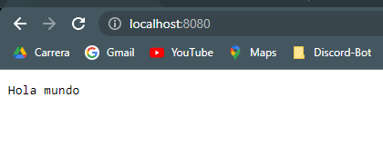
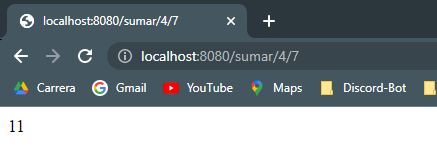
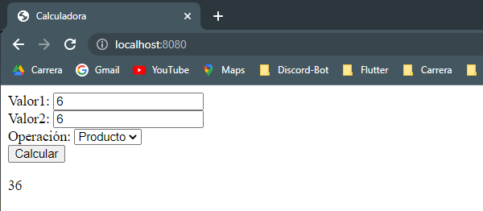
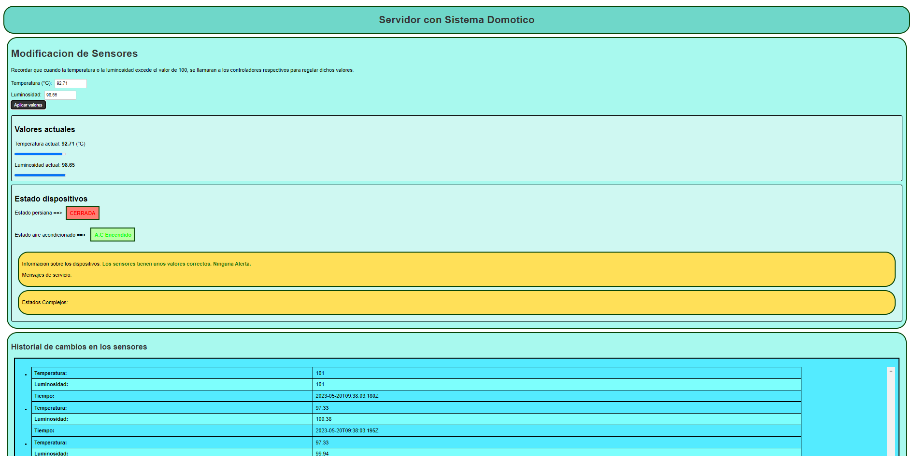

# Desarrollo de Sistemas Distribuidos

## Práctica 4: Node.js

*David Martinez Diaz*

## Parte 1: Implementacion y justificacion de los ejemplos

Para la ejecucion de los ejemplos, ha sido necesario la instalacion de los paquetes de nodejs, socketio y mongodb, donde para iniciar los servicios de la web he introducido el siguiente comando:

``` 
node servicio.js 
```

Una vez ejecutado el comando, podemos ver el servicio iniciado en nuestro navegador, donde usualmente se encontrara alojado en "localhost:8080".

---

### 1. Hello World:

Este primer ejemplo, lo unico que hace es crear un servidor HTTP y construye una respuesta cuyo contenido es "Hola Mundo" en texto plano y se lo pasa al navegador.




---

### 2. Calculadora.js:

Para el segundo ejemplo, tenemos la implementacion de una calculadora la cual recibe peticiones REST, para su uso, si pones la direccion url predeterminado te salda un mensaje por defecto:


Sin embargo, si le pasamos por la URI del servicio, en primer lugar la operacion a realizar, y luego los operandos vemos como si ejecuta la operacion y lo muestra por pantalla:



Su funcionamiento se basa en crear un servidor HTTP y a partir de la URI obtiene los valores de la operacion, donde los divide en 3 y pasando dichos parametros a la funcion que calcula el valor, donde acaba por enviar la respuesta con el resultado de dicha operacion con el objeto "response".

---

### 3. Calculadora-web.js:

Este ejemplo, es la continuacion del anterior, la cual tambien recibe peticiones REST pero ahora tiene la implementacion de una interfaz para el usuario hecha en html, por lo que ya no es necesario introducir los datos por la URI, ahora disponemos del siguiente formulario:



Este servicio tiene un funcionamiento parecido, ya que si le pasamos los parametros por la URI se ejecutara igual que en el anterior ejemplo, sin embargo, si no le pasamos ningun parametros se mostrara el formulario para poder realizar las operaciones, a traves de la comprobacion del fichero html y lo muestra escribiendo en el objeto "response" los datos html. 

En cuanto al archivo html, vemos que esta compuesto por un formulario, y cuando se le da al boton de calcular llama a un script de JS:

```<form action="javascript:void(0);" onsubmit="javascript:enviar();">```

Donde dicho script realiza una peticion AJAX al servicio, cogiendo los datos del formulario y cuando obtiene el resultado lo añade al html:

```js
var serviceURL = document.URL;
		function enviar() {
			var val1 = document.getElementById("val1").value;
			var val2 = document.getElementById("val2").value;
			var oper = document.getElementById("operacion").value;
			
			var url = serviceURL+"/"+oper+"/"+val1+"/"+val2;
			var httpRequest = new XMLHttpRequest();
			httpRequest.onreadystatechange = function() {
		    	if (httpRequest.readyState === 4){
		        	var resultado = document.getElementById("resul");
		        	resultado.innerHTML = httpRequest.responseText;
		        }
		    };
			httpRequest.open("GET", url, true);
			httpRequest.send(null);
		}
```
---
### 4. Connections.js:

Aqui hacemos ya la introduccion al paquete de "socket.io", el cual utilizaremos para actualizar nuestra pagina web si necesidad de recargarla manualmente.

El servicio consiste en mostrar la direccion del usuario y el puerto desde el que se conecta al servidor. Ademas, la direccion es la misma y la informacion se actualiza en tiempo real. Si tenemos dos clientes o pestañas activas, se mostraran una lista de dos elementos, sin embargo, Si se cerrase una pestaña, se eliminaria dicho cliente:


En primer lugar, hablaremos de "connections.js", donde el servicio crea un servidor HTTP de la misma manera que "calculadora-web.js", mostrando el archivo html correspondiente. 

Por otro lado, una vez se encuentra escuchando en el puerto especificado, se crea el servicio para "socket.io", y se construye un array de clientes y se almacenan aquellos que se conecten al servidor, es decir, cada vez que se detecte una conexion mediante la subscripcion al evento ==> "connection":

```js
httpServer.listen(8080);
var io = socketio(httpServer);

var allClients = [];

io.sockets.on('connection', function(client) {
  allClients.push({address: client.request.connection.remoteAddress, port: client.request.connection.remotePort});
  console.log('New connection from ' + client.request.connection.remoteAddress + ':' + client.request.connection.remotePort);
```

Posteriormente se llamará a una funcion ==> "all-connections", para tramsmitir dicha conexion nueva a los demas clientes que ya se encuentren conectados. Despues, se quedara esperando en la funcion on para recibir un evento del tipo "output-evt", el cual trata de un ping del cliente, para verificar la conexion y posteriormente el servidor le enviara un emit del mismo tipo para que este lo muestre en su navegador:

```js
io.sockets.emit('all-connections', allClients);
  
  client.on('output-evt', function(data) {
    client.emit('output-evt', 'Hola Cliente!');
  });
```

Por ultimo se hace una subscripcion al evento "disconnect" para poder eliminar al cliente de la lista y se manda un nuevo mensaje con la lista actualizada a todos los clientes que permanezcan conectados:

```js
client.on('disconnect', function() {
    console.log("El cliente " + client.request.connection.remoteAddress + " se va a desconectar");
    console.log(allClients);

    var index = -1;
    for (var i = 0; i < allClients.length; i++) {
      if (allClients[i].address == client.request.connection.remoteAddress && allClients[i].port == client.request.connection.remotePort) {
        index = i;
      }
    }

    if (index != -1) {
      allClients.splice(index, 1);
      io.sockets.emit('all-connections', allClients);
    } else {
      console.log("EL USUARIO NO SE HA ENCONTRADO!");
    }

    console.log('El usuario ' + client.request.connection.remoteAddress + ' se ha desconectado');
  });
```

Y por otro lado tenemos **"clienteSocket.html"**, que como se ha definido anteriormente tambien tiene una estructura parecida para mostrar los datos que le llegan. Ahora tenemos un script de javascript para conectar con "socket.io":

```js
var serviceURL = document.URL;
var socket = io.connect(serviceURL);
```

Entre los eventos tenemos "connect", para conectarnos y establecer el ping, "output-evt" para mostrar el mensaje del servidor en la web y "disconnect" para cuando el servidor caiga.

Por ultimo, tenemos "all-connections" que es un evento para actualizar la lista de los clientes conectados:

```js
socket.on('connect', function () {
        socket.emit('output-evt', 'Hola Servicio!');
      });
      socket.on('output-evt', function (data) {
        mostrarMensaje('Mensaje de servicio: ' + data);
      });
      socket.on('all-connections', function (data) {
        actualizarLista(data);
      });
      socket.on('disconnect', function () {
        mostrarMensaje('El servicio ha dejado de funcionar!!');
      });
```
---

### 5. Mongo-test.js:

Para este ultimo ejemplo, se utiliza una combinacion de los paquetes "socket.io" y "mongodb", para poder almacenar y sacar los datos de una base de datos. Donde al igual que en el ejemplo anteior se muestra la direccion del cliente, el puerto y el tiempo de conexion. La informacion se va actualizando a tiempo real, pero ahora si se desconecta un cliente no deberia eliminarse de la lista sino que se quedase como un registro:


Ademas si lo ejectuas dos veces, tendras el siguiente problema:


¿Como se soluciona? ==> Pues depende de lo queramos hacer:

* Podemos eliminar la coleccion cuando iniciamos el servidor si no necesitamos los datos anteriores y luego volver a crear la coleccion, de tal manera que quedaria asi:

```js
dbo.collection("test").drop(function(err, delOK) {
  if (err) throw err;
  if (delOK) console.log("Colección existente eliminada");
});

dbo.createCollection("test").then((collection))...
```

* La segunda opcion, seria en vez de crear una coleccion cada vez que se inicia el servidor, usamos una coleccion existente y quedaria de la siguiente manera:

```js
dbo.collection("test").then((collection))...
```

En cuanto a los codigos, podemos ver que en **"mongo-test.js"**, el servicio crea el servidor HTTP de igual manera que en los ejemplos anteriores. Todo sigue igual que antes sin embargo, al final se añada la conexion con la base de datos y se crea la coleccion "test".

Lo primero que se hace es enviar un mensaje de evento "my-address" que envia los datos del cliente como antes, y luego escuchara a dos eventos del cliente:

* "poner" ==> en este evento se reciben los datos del cliente y se almacenen en la base de datos.
* "obtener" ==> aqui se recibe la peticion del cliente y se hace una consulta a la base de datos y se le pasa los datos necesarios al cliente.

```js

io.sockets.on('connection', function(client) {
      
      client.emit('my-address', {
        host: client.request.connection.remoteAddress,
        port: client.request.connection.remotePort,
      });

      client.on('poner', function(data) {
        collection.insertOne(data, {safe:true}).then((result) => {

          console.log(data);
        }).catch((err) => {
          console.error(err);
        });
      });
        
      client.on('obtener', function(data) {
        collection.find(data).toArray().then( (results) => {

          client.emit('obtener', results);
        }).catch((err) => {
          console.error(err);
        });
      });
});
```

Y por ultimo el archivo html, que al igual que los ejemplos anteriores se definen los bloques donde se mostraran los datos y tambien se define un script de js con el cual se subcribiran a los eventos para obtener y pasar la informacion requerida por el servidor:

```js
var serviceURL = document.URL;
    var socket = io.connect(serviceURL);

    socket.on('my-address', function (data) {
      var d = new Date();
      socket.emit('poner', { host: data.host, port: data.port, time: d });
      socket.emit('obtener', { host: data.address });
    });

    socket.on('obtener', function (data) {
      actualizarLista(data);
    });

    socket.on('disconnect', function () {
      actualizarLista({});
    });
```

---

<div style="page-break-after: always;"></div>

## Sistema Domotico:

Para el ejercicio se pide la implementacion de un sistema basico que constará de dos sensores (luminosidad y temperatura) y que estaran controlados por dos actuadores (motor persiana y sistema de aire/acondicionado). Para ello se elaborará un servidor para  mostrar el estado y controlar los elementos del hogar, el cual contará tambien con un agente inteligente que notificara del estado de la casa y podra realizar operaciones basica cuando se hayan pasado algunos valores limites.

### Explicacion tecnicas cooperacion

En cuanto a las tecnicas utilizadas para la comunicacion entre los nodos, podemos comentar el uso del descubrimiento, lo que implicar encontrar o conectar con otros nodos que se encuentran conectados a la red. 

Esto lo podriamos observar cuando un cliente se conecta al servidor a traves del paquete "Socket.io", consiguiendo descubrir un nuevo cliente y pudiendo interacturar con el:

```js
io.sockets.on('connection', function (client) {...})
```

Por otro lado, podriamos decir que tambien he utilizado la actualizacion de datos, ya que por ejemplo, cuando un cliente conectado, se le envia datos actualizados de las medidas de los sensores de la casa:

```js
io.sockets.emit('medidas-casa', medidas_sensores
```

Ademas cuando un cliente envia datos de los sensores al servidor:

```js
client.on('obtener-sensores', function (data) {...}
```

Donde estos datos se utilizan para almacenar en una base de datos en MongoDB y se utilizan para actualizar el estado actual de los sensores, y por ultimo, los clientes tambien pueden obtener todas las medidas registradas en la base de datos:

```js
client.on('obtener-medidas', function (data) {...}
```
### **Introduccion a los servicios implementados**

#### 1. Sistema_Domotico.js:

Este archivo, es el servidor implementado en "node.js" y el que se encargará de lanzar las paginas webs, y dependiendo de la URI le indicamos que utilice el html del sistema o del cliente de la casa:

```js
const httpServer = http.createServer((request, response) => {

   let uri = url.parse(request.url).pathname;
   if (uri == "/")
      uri = "/sistema_domotico.html";
   else if (uri == "/cliente")
      uri = "/cliente.html";

   const filename = path.join(process.cwd(), uri);

   fs.exists(filename, (exists) => {
      if (exists) {
         fs.readFile(filename, (err, data) => {
            if (!err) {
               const extension = path.extname(filename).split(".")[1];
               const mimeType = mimeTypes[extension];
               response.writeHead(200, { "Content-Type": mimeType });
               response.write(data);
               response.end();
            } else {
               response.writeHead(500, { "Content-Type": "text/plain" });
               response.write(`Error de lectura en el fichero: ${uri}`);
               response.end();
            }
         });
      } else {
         console.log(`Peticion invalida: ${uri}`);
         response.writeHead(404, { "Content-Type": "text/plain" });
         response.write("404 Not Found\n");
         response.end();
      }
   });
});
```
Las medidas que van a tomar el sistema domotico, a nivel basico son los siguientes:

```js
var tiempo = new Date();
var medidas_sensores = { temperatura: 0, luminosidad: 0, tiempo: tiempo };
```
* Temperatura: controlado por el aire acondicionado.
* Luminosidad: controlado por la persiana.
* Tiempo.

Por otro lado, como hemos visto en los ejemplos se implementan distintos eventos a traves del paquete "socket.io" para poder centralizar las interacciones realicen los distintos servicios web. 

Ademas, tambien gestiona la creacion y manipulacion de la base de datos en MongoDB a traves del paquete de node.js ==> "mongodb", y poder acceder a los registros que haya sobre la manipulacion y deteccion de valores de los sensores. Para el error de ejecutar dos veces el codigo y que no haya errores, he optado por eliminar la coleccion cada vez que se inicia el servicio, ya que los datos al final y al cabo son irrelevantes:

```js
MongoClient.connect("mongodb://127.0.0.1:27017/", function (err, db) {
}).then((db) => {

   // Escuchamos en el puerto 8080
   httpServer.listen(8080);

   // Iniciamos el servicio de socketio
   var io = socketio(httpServer);
   console.log("Servicio Sistema Domotico iniciado");

   // Cargamos la base de datos
   var dbo = db.db("DSD-P4");

   // Eliminamos la coleccion para solventar el problema de crear una coleccion existente
   dbo.collection("Sistema-Domotico").drop(function (err, delOK) {
      if (err) throw err;
      if (delOK) console.log("Colección existente eliminada");
   });
});
```

En cuanto a los archivos html, distinguimos entre el cliente y el del sistema:

Si empezamos comentando el del sistema, en terminos generales, actua como el administrador y podemos observar que el sistema puede introducir los valores que detectan los sensores de manera manual a traves de un formulario y los manda hacia el servidor para que este se lo pase al cliente y los imprime junto con una barra de progreso para que se vea de manera mas visual, ademas se que se almacena en el registro de medidas:

```html
<form action="javascript:void(0);" onsubmit="javascript:enviar();">
            Temperatura (°C): <input type="number" id="inputTemperatura" /> <br/>
            Luminosidad: <input type="number" id="inputLuminosidad" /> <br/>
            <input type="submit" value="Aplicar valores" />
        </form>
        
        <div id="resultadosActuales">

            <h2>Valores actuales</h2>

            <p>Temperatura actual: <span id="valorTemperatura"></span> (°C)</p>
            <progress id="barraTemperatura" value="0" min="-100" max="100"></progress>
            <p>Luminosidad actual: <span id="valorLuminosidad"></span></p>
            <progress id="barraLuminosidad" value="0" min="-100" max="100"></progress>

        </div>
```

Por otro lado informa tanto de las alertas que se reciban por parte del agente automatico como de los estados de los controladores:

```html
<div id="estadoDispositivos">

            <h2>Estado dispositivos</h2>

            <p>Estado persiana ==><span id="sensorPersiana" style="color: red">CERRADA</span></p>
            <p>Estado aire acondicionado ==> <span id="sensorAire" style="color: red">APAGADO</span></p>
            
            <div id="infoAlertas">

                <p>Informacion sobre los dispositivos: <span id="alerta"></span></p>
                <p>Mensajes de servicio: <span id="mensaje_servicio" style="color: red;"></span> <br /></p>
            </div>
            
        </div>
```

Y por ultimo tenemos una seccion donde se mostrara el historial de las medidas tomadas con el tiempo de estos:

```js
<section id="seccionHistorial">

        <nobr>
            <h1>Historial de cambios en los sensores</h1>

            <div id="historial"></div>
            <form action="javascript:void(0);" onsubmit="javascript:borrarHistorial();">
                <input type="submit" value="Borrar histórico" />
            </form>
        </nobr>
        
    </section>
```
---

Y en el cliente, pasa exactamente igual, es decir, se muestran los valores de las medidas actuales de la temperatura y la luminosidad:

```js
<div id="valoresActuales">

            <h2>Valores Actuales: A.C</h2>
            <p>
               <nobr>
                  <label for="temperatura">Temperatura (°C):</label>
                  <progress id="temperatura" value="0" min="-100" max="100"></progress>
                  <span id="tempval" style="font-weight: bold;"></span>
               </nobr>
            </p>
   
            <ul>
               <li>Apagar el aire acondicionado implica tener más temperatura</li>
               <li>Encender el aire acondicionado implica tener menos temperatura</li>
            </ul>

         </div>
```

Pero, en el caso del cliente, tenemos la posibilidad de modificar el estado de los controladores para poder modificar dichos valores con interruptores y ser capaces de activar el aire acondicionado y abrir/cerrar las persianas:

* Para el caso del aire acondiconado:
  
```html
<section id="seccionAire">
         
         <h2>Seccion Aire Acondicionado</h2><br>
         <p>Estado A.C ==> <span id="estadoAire" style="color: red">APAGADO</span></p>

         <p>Apagar/Encender A.C</p>
         <form id="botonesAire" action="javascript:void(0);" onsubmit="javascript:controlAire();">
            
            <label class="switch">
               <input type="checkbox" id="aire">
               <span class="slider round"></span>
            </label>
            
            <input type="submit" value="Aplicar" />
         </form>

         <div id="valoresActuales">

            <h2>Valores Actuales: A.C</h2>
            <p>
               
                  <label for="temperatura">Temperatura (°C):</label>
                  <progress id="temperatura" value="0" min="-100" max="100"></progress>
                  <span id="tempval" style="font-weight: bold;"></span>
               
            </p>
   
            <ul>
               <li>Al desactivar el aire acondicionado, permitimos que la temperatura aumente.</li>
               <li>Al activar el aire acondicionado, logramos reducir la temperatura.</li>
             </ul>

         </div>
         
      
      </section>
```

* Para el caso de la persiana:

```html
<section id="seccionPersiana">
         
         <h2>Seccion Persiana</h2><br>
         <p>Estado Persiana ==> <span id="estadoPersiana" style="color: red">CERRADA</span></p>

         <p>Cerrar/Abrir Persiana</p>
         <form id="botonesPersiana" action="javascript:void(0);" onsubmit="javascript:controlPersiana();">
           
            <label class="switch">
               <input type="checkbox" id="persiana">
               <span class="slider round"></span>
            </label>
            <input type="submit" value="Aplicar" />
         </form>

         <div id="valoresActuales">

            <h2>Valores Actuales: Persiana</h2>
            <p>
               
                  <label for="luminosidad">Luminosidad (0 - 100):</label>
                  <progress id="luminosidad" value="0" max="100"></progress>
                  <span id="lumval" style="font-weight: bold;"></span>
               
            </p>
   
            <ul>
               <li>Al cerrar la persiana, reducimos la cantidad de luz que ingresa, disminuyendo así la luminosidad.</li>
               <li>Al abrir la persiana, permitimos que más luz entre, aumentando la luminosidad.</li>
             </ul>

         </div>
         
      
      </section>
```
  
---

<div style="page-break-after: always;"></div>

**Eventos:**

Para ver como funciona el sistema, hay que ver los eventos implementados con socketio, ya que son las comunicaciones que se utilizan para enviar mensajes entre las distintas partes:

* 1. "Connection": este evento se llama cuando se conecta un nuevo cliente al servidor. Y se obtienen todas las medidas de los sensores.
  
* 2. "Medidas-casa": este evento es muy importante, ya que es el encarga de enviarle los datos de los sensores a los clientes, ya que estos estan suscritos a este evento:

```js
socket.on('medidas-casa', function (data) {
        mostrarMedidas(data);
    });
```

* 3. "Obtener-medidas": este evento se utiliza para actualizar la lista del registro de la bd en la web del cliente y del sistema.

```js
// Se obtienen de la base de datos todas las medidas registradas y se emiten.
            client.on('obtener-medidas', function (data) {
               collection.find(data).toArray().then((results) => {
                  client.emit('obtener-medidas', results);
               }).catch((err) => {
                  console.error(err);
               });
            });
```

* 4. "Borrar-Historial": este evento se utiliza para limpiar el registro de las medias tomadas:

```js
client.on('borrar-historial', function () {
               collection.drop();
               client.emit('obtener-medidas', null);
            });
```

* 5. "Info-Alertas": este evento sirve para saber cuando se han dado unos valores que han superado el umbral permitido por lo que se envian alertas a los clientes y al sistema y el agente se encarga de regularlo automaticamente:

```js
socket.on('info-alertas', function (alerta, data) {
        
        var alertaHtml = document.getElementById("alerta");
        alertaHtml.innerHTML = alerta;
        
        if (alerta[0] != 'L') {
            alertaHtml.style.color = '#FF0000';
        } else {
            alertaHtml.style.color = '#1f7507';
        }

        mostrarMedidas(data);
    });
```

* 6. "Disconnect": este evento se utiliza con la desconexion de algun cliente y se muestra un mensaje por la terminal informando de lo ocurrido.

* 7. "Obtener-Sensores": es el evento principal del sistema, ya sea cuando el sistema o el cliente modifican los valores, estos se actualizan y los envia, donde el servidor al recibirlo, los inserta en la base de datos y deja pasa al agente automatico para analizar dichos valores por si es necesario realizar alguna correcion:

```js
// Los sensores envían los datos, y añadimos los valores al registro de la BD.
            client.on('obtener-sensores', function (data) {

               // Obtiene los valores de los sensores
               console.log(data);
               medidas_sensores = data;

               // Los mete en la coleccion creada
               collection.insertOne(data, { safe: true }).then((result) => { }).catch((err) => {
                  console.error(err);
               });

               var alerta = "Los sensores tienen unos valores correctos. Ninguna Alerta.";

               // Implementacion del agente, el cual detecta si se ha superado los umbrales 
               // establecidos y procede a regularlo.

               switch (true) {
                  case data.temperatura > 100 && data.luminosidad > 100:
                    alerta = "⚠️ ALERTA: La temperatura y la luminosidad están demasiado altas. Se cerrará la persiana y se encenderá el aire acondicionado.";
                    io.sockets.emit('cierra-persiana');
                    io.sockets.emit('enciende-aire');
                    break;
                  case data.temperatura > 100 && data.luminosidad < 0:
                    alerta = "⚠️ ALERTA: La temperatura está demasiado alta y la luminosidad demasiado baja. Se abrirá la persiana y se encenderá el aire acondicionado.";
                    io.sockets.emit('abre-persiana');
                    io.sockets.emit('enciende-aire');
                    break;
                  case data.temperatura > 100:
                    alerta = "⚠️ ALERTA: La temperatura está demasiado alta. Se encenderá el aire acondicionado.";
                    io.sockets.emit('enciende-aire');
                    break;
                  case data.temperatura < -100 && data.luminosidad > 100:
                    alerta = "⚠️ ALERTA: La temperatura está demasiado baja y la luminosidad demasiado alta. Se cerrará la persiana y se apagará el aire acondicionado.";
                    io.sockets.emit('cierra-persiana');
                    io.sockets.emit('apaga-aire');
                    break;
                  case data.temperatura < -100 && data.luminosidad < 0:
                    alerta = "⚠️ ALERTA: La temperatura está demasiado baja y la luminosidad demasiado baja. Se abrirá la persiana y se apagará el aire acondicionado.";
                    io.sockets.emit('abre-persiana');
                    io.sockets.emit('apaga-aire');
                    break;
                  case data.temperatura < -100:
                    alerta = "⚠️ ALERTA: La temperatura está demasiado baja. Se apagará el aire.";
                    io.sockets.emit('apaga-aire');
                    break;
                  case data.luminosidad > 100:
                    alerta = "⚠️ ALERTA: La luminosidad está demasiado alta. Se cerrará la persiana.";
                    io.sockets.emit('cierra-persiana');
                    break;
                  case data.luminosidad < 0:
                    alerta = "⚠️ ALERTA: La luminosidad está demasiado baja. Se abrirá la persiana.";
                    io.sockets.emit('abre-persiana');
                    break;
                }                

               // Se envía a los clientes el mensaje de alerta
               io.sockets.emit("info-alertas", alerta, data);

               // Se envía a los clientes las nuevas medidas que nos dan los sensores
               io.sockets.emit('medidas-casa', data);
            });
```
---

Y de este evento principal, derivan los evento de control para regular la luminosidad y la temperatura, por lo que tenemos los siguientes eventos:

Por parte del aire acondicionado:

* "apaga-aire": este evento ocurre cuando la temperatura es muy baja, consiguiendo aumentar su numero.
* "enciende-aire": este evento ocurre justo al contrario.

---

Y por parte del motor de la persiana:

* "cierra-persiana": este evento ocurre cuando la luminosidad es muy alta, consiguiendo bajarlo en un numero indeterminado de unidades.
* "abre-persiana": justamente al contrario de cuando se cierra la persiana.

---

Por otro lado, estos valores son modificados por el agente de manera automaticamente, sin embargo, cuando implementamos la parte del cliente, he introducido una serie de eventos para que dicho cliente pueda modificar esos valores a su gusto, claro esta, sin sobrepasar el umbral especifico (100), siendo los mismos metodo que los de arriba pero añadiendo cliente al final, tal y como muestro ahora:

```js
// El cliente solicita apagar el aire, por lo que se llama al servidor para que lo realice.
            client.on('apaga-aire-cliente', function () {
               io.sockets.emit('apaga-aire');
            });

            // El cliente solicita encender el aire, por lo que se llama al servidor para que lo realice.
            client.on('enciende-aire-cliente', function () {
               console.log("Enciendo el aire caliente");
               io.sockets.emit('enciende-aire');
            });

            // El cliente solicita cerrar la persiana, por lo que se llama al servidor para que lo realice.
            client.on('cierra-persiana-cliente', function () {
               io.sockets.emit('cierra-persiana');
            });

            // El cliente solicita abrir la persiana, por lo que se llama al servidor para que lo realice.
            client.on('abre-persiana-cliente', function () {
               io.sockets.emit('abre-persiana');
            });
```
---

<div style="page-break-after: always;"></div>

## Partes opcionales:

### **Deteccion de eventos complejos:**

Para las partes opcionales he implementado la deteccion de eventos complejos, para diferentes situaciones, es decir, cuando la persiana esta cerrada y el aire acondicionado esta apagado o cuando la persiana esta abierta y el aire acondicionado encendido. Para ello, he realizado las siguientes implementaciones:

En el archivo "sistema-domotico.js" he implementado el siguiente evento:

```js
client.on('estado-controladores', function (data) {

               var persianaAbierta = data.estadoPersiana;
               var aireEncendido = data.estadoAire

               if(persianaAbierta == 1 && aireEncendido == 1){

                  console.log("Entro dentro de la alerta compleja");
                  var alerta = "⚠️⚠️⚠️ ALERTA COMPLEJA: El aire y la persiana estan activos a la vez";
                  io.sockets.emit('alerta-compleja', alerta);
               }
               else if (persianaAbierta == 0 && aireEncendido == 0){
                  console.log("Entro dentro de la alerta compleja");
                  var alerta = "⚠️⚠️⚠️ ALERTA COMPLEJA: El aire y la persiana estan desactivados a la vez";
                  io.sockets.emit('alerta-compleja', alerta);
               }
               else {
                  console.log("Entro dentro de la alerta compleja");
                  var alerta = "";
                  io.sockets.emit('alerta-compleja', alerta);
               }
               
            });
```

Donde compruebo el estado de los controladores/actuadores y dependiendo de eso, muestro un mensaje de alerta u otro, para ello me he tenido que crear otro evento "alerta-compleja" que pasara dicha informacion a los clientes web:

```js
socket.on('alerta-compleja', function (alerta) {
        
        // Obtengo el contenedor donde mostrare las alertas detectadas por el agente automatico
        var alertaComplejaHtml = document.getElementById("alertaCompleja");
        alertaComplejaHtml.innerHTML = alerta;

        alertaComplejaHtml.style.color = '#1f7507';
    });
```

Por otro lado, en la parte de los clientes he tenido que crearme dos variables de estado para poder saber en todo momento cual es el estado actual de los actuadores y pasarle dichos estados al servidor para que haga el la comprobacion:

```js
estadoAire = 0;
socket.emit('estado-controladores', {estadoAire: estadoAire, estadoPersiana: estadoPersiana});
```

---

### **Envio de correos con "nodemailer":**

En este caso, he decidido utilizar la API de google para poder enviar correos, ya que no era posible utilizar la API de twitter pues no nos dejaban acceso a la API v2 que te permitia publicar tweets, por esto, he decido utilizar el paquete "nodemailer" para enviar correos en vez de tweets. Consiste en enviar correos al "cliente", en este caso hacia a mi cuando se dan unos valores muy altos, es decir, cuando la temperatura y la luminosidad este muy alta enviar una alerta por correo:

En primer lugar tuve que instalarme el paquete de "nodemailer":

```
npm install nodemailer"
```

Y luego implementamos el paquete y añadimos las credenciales y la estructura de los envios de correo, tal y como muestro ahora:

```js
const nodemailer = require('nodemailer');

const transporter = nodemailer.createTransport({
   service: 'Gmail',
   auth: {
     user: 'martdiaz01.d@gmail.com',
     pass: 'fejseqbjomcawulf',
   },
 });

 const mailOptions = {
   from: 'martdiaz01.d@gmail.com',
   to: 'martdiaz01.d@gmail.com',
   subject: 'Alerta',
   text: '',
 };
```

Y cuando queremos enviar las alertas, utilizamos este codigo:

```js
mailOptions.text = '¡Alerta! La temperatura y la luminosidad son demasiado altas en el sistema domótico.';

                    transporter.sendMail(mailOptions, (error, info) => {
                     if (error) {
                       console.log('Error al enviar el correo:', error);
                     } else {
                       console.log('Correo enviado:', info.response);
                     }
                   });
```

Y el resultado es este:


---

<div style="page-break-after: always;"></div>

## Ejemplos de ejecucion:

### Caso del sistema domotico:

Aqui vemos una captura del sistema domotico, donde vemos que ahora mismo se encuentran los valores de temperatura y luminosidad de manera estable, por lo que no se producen ninguna alerta y vemos el estado de los actuadores, estando la persiana cerrada y el aire acondicionado encendido.

Para ello, la URL sera: "localhost:8080".



### Caso del cliente:

Y por otro lado tenemos el caso del cliente que puede manipular a su gusto tanto el aire acondicionado como la persiana, podemos ver el valor de las medidas y la informacion sobre los dispositivos y las alertas complejas:

Para ello, la URL sera: "localhost:8080/cliente".


  


