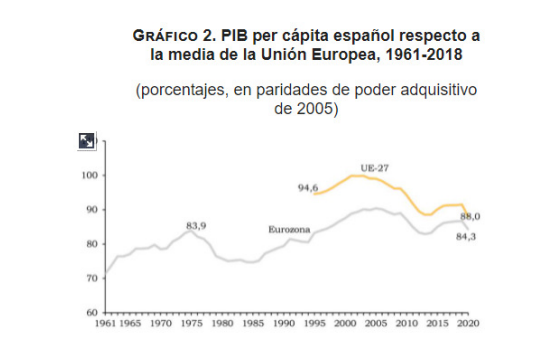

<h1>Tema 1: La economía española
en perspectiva: de la autarquía a la
convergencia Europea. </h1>

<h2>1. Características de la economía española a finales de los años
50 del siglo XX en relación a la situación actual</h2>

**<h3> 1939-1959: Autarquía</h3>**

España está aislada del exterior, buscando basar su crecimiento en la producción con recursos y factores únicamente internos, sin comprar nada del exterior. Esto lleva al aislamiento exterior, con un gran intervencionismo gubernamental. 

En este momento se están creando instituciones internacionales de las cuales España no era partícipe y de las cuales no se podía aprovechar, mientras que en otros países se estaba dando un momento de gran crecimiento.

***Puntos débiles:***
* Desequilibrio de la Balanza por cuenta corriente ⇒ pocas exportaciones de poco valor (especialmente agrarias) y pocas importaciones, pero con mayor valor (especialmente de fuentes de energía).
* Espiral precios-salarios a partir de 1955 = Inflación.
* Déficit del sector público ⇒ grandes gastos e insuficiencia recaudatoria.

---
**<h3>Plan de Estabilización de 1959:</h3>**

En este momento surgen una serie de objetivos para intentar acabar con esta situación insostenible, los cuales se recogen en el ***Plan de Estabilización de 1959:***

* Reducir intervencionismo de la economía.
* Alinearla con las economías de mercado de los países europeos. Abrirnos al exterior para aprovecharnos del flujo económico que se daba entre el resto de países.
  
Este plan daría lugar a un gran cambio en el rumbo de la economía española.
Entonces las medidas para el Plan de Estabilización fueron:

**De apoyo:**

1. Formación de un gobierno sólido (1957).
2. Consenso con todos los Organismos e Instituciones españolas.
3. Apoyo financiero de organismos económicos internacionales (FMI, OECE).

---
**Políticas de Ajuste:**

1. ***Equilibrio presupuestario y estabilidad monetaria interior.***

    a. Reforma fiscal ⇒ encaminada a crear más impuestos para incrementar los ingresos del Estado.
    
    b. Contención del Gasto Público.
    
    c. Reducir el crecimiento de la masa monetaria.
    
    d. Contención de la demanda interna. 

2. ***Equilibrio externo y estabilidad monetaria exterior.***

    a. Integración de la peseta en el Sistema Monetario Internacional.

    b. Restricción de Importaciones e incremento de exportaciones.
    
    c. Apertura a la inversión extranjera.

3. ***Orientación al crecimiento de la producción.***

    a. Apoyo de la inversión privada mediante políticas fiscales de exención.
    
    b. Fomento de la inversión exterior.

---

**Reformas estructurales e institucionales**

   1. Incremento del grado de apertura al exterior.

        a. Adhesión al FMI, BM, OECE, GATT.
    
        b. Nuevo arancel en 1960.

   2. Racionalización del aparato político-administrativo. (reorganización o simplificación del sistema de gobierno y administración pública de un país o entidad política).
   
   3. Flexibilización tímida del sistema productivo.

        a. Mayor grado de libertad de la inversión.
    
        b. Ampliación y traslado de establecimientos industriales.

   4. Flexibilización tímida del mercado de trabajo.

        a. Ley de Contratos de Trabajo. (regula las relaciones laborales entre empleadores y trabajadores).
        
        b. 1961 creación del seguro de desempleo. 
        
Estos planes dieron lugar en los años 60 a un gran crecimiento en la economía española. 

---

<h2>2. Crecimiento y convergencia de la economía española 1959 - 2020: una visión general </h2>

    Un primer rasgo a destacar del crecimiento de la economía española en el período acotado en el gráfico, tomando como indicador la tasa de variación del PIB per cápita, es la tasa media anual alcanzada (2’3 %), que supera holgadamente la media de los países comunitarios. España, por tanto, ha superado el ritmo de avance de las naciones europeas más maduras, multiplicando por 6 la renta nacional en el plazo estudiado.

--

    El 2º rasgo a considerar es el perfil temporal seguido por la renta per cápita, que se asemeja mucho al de los países comunitarios. Se muestra que, incluso antes de pertenecer a la UE, España ya participaba con intensidad de los acontecimientos económicos fundamentales. 

**Distinguimos 5 etapas bien diferenciadas en este período:**

* **1ª Etapa 1959 - 1974:**
  
  * Etapa de rápido aumento en el PIB per cápita y de convergencia con la media de Europa.
  * Son los años del crecimiento industrial acelerado, con importante apertura al comercio exterior y a la inversión extranjera. 
  * Orientación de la política económica muy diferente a la predominante en las décadas previas.
  * Este crecimiento presenta una progresión muy irregular, con picos de crecimiento muy superiores a otros.
  * Crecimiento cuyo origen se encuentra, principalmente, en el aumento de la demanda interna.

--
* **2ª Etapa 1974 - 1985:**
  *   Etapa de crisis económica y de divergencia con Europa en cuanto a la evolución de la renta per cápita.
  *   Alteraciones profundas en el escenario económico internacional.
  *   Cambios institucionales internos debido a la transición política hacia la democracia. 

--
* **3ª Etapa 1985 - 1995:**
  * Coincide con la incorporación de España a la UE.
  * Muestra un perfil evolutivo del PIB per cápita aún más semejante al de los países comunitarios.
  * Los efectos del proceso de unificación de Alemania acentúan la fase recesiva de este ciclo, que de otra forma, se habría cerrado sin disminución del PIB real.
  * Crisis interna en 1993 - 1994. 

--
* **4ª Etapa 1996 - 2007:**
  
  * Caracterizada por la combinación de un apreciable ritmo de crecimiento de la renta per cápita con una notable estabilidad macroeconómica, en gran medida resultado del eficaz ajuste realizado para asegurar el buen funcionamiento del euro.
  * Ritmo elevado de crecimiento.
  * Estabilidad macroeconómica, con desequilibrios en los últimos años del período.
  * Integración en la 3ª Fase de la UEM.
  * Hasta 2007, se da una etapa de crecimiento ininterrumpido, con la entrada en el Euro.
  * Pero a partir de 2007, empieza la Gran Recesión por la burbuja inmobiliaria.
  * En esta etapa, el empleo se mantuvo parejo al crecimiento del PIB, creciendo incluso más, por lo que se perdió algo de productividad.

--
* **5ª Etapa 2008 - 2020:**

  * Etapa definida por una larga y profunda recesión a la que sigue una rápida y sobresaliente recuperación de los niveles de PIB iniciales, de nuevo perdidos en 2020, como consecuencia de la pandemia.
  * La profunda crisis se debió a los desequilibrios de las etapas anteriores.
  * Crisis financiera internacional y alejamiento en renta per cápita con la UE.
  * Recuperación a partir de 2014 a 2019, truncada por la pandemia, que trajo una caída del PIB real y de la renta per cápita, con más intensidad de la media europea.
  * Durante los años de crisis, el empleo bajó aún más que el PIB, por lo que se ganó en productividad, lo cual hizo que se produjese una devaluación interna, es decir, conseguimos que nuestros productos tuviesen un menor coste (estadísticamente es lo que se refleja, porque las estadísticas oficiales no tienen en cuenta la economía sumergida).

--

    Un tercer rasgo característico del crecimiento económico español es la mayor profundidad de las cuatro crisis que se han producido durante el período estudiado. 
---

En el gráfico 2, vemos que hay países de la UE-27 con un PIB per cápita ppp más pobres que nosotros, lo que hace que la ratio sea mayor que cuando nos comparamos con los países de la Eurozona.

    Un cuarto rasgo característico es que las fluctuaciones que se producen en cada una de las 5 grandes etapas consideradas poseen un carácter más marcado en España. 

---
**<h3> Principales rasgos del crecimiento económico: </h3>**

1. España ha crecido a un ritmo mayor que los países europeos.

Entre 1960 y 2019 la economía española ha incrementado su PIB per cápita en un 2’6 % de media anual acumulativa, frente al 2’1 % de media de la UE-15.

2. Además, el crecimiento de la renta en España ha sido similar en el tiempo al de los países occidentales europeos.
   
Aún antes de pertenecer a la UE, España ha participado intensamente en las relaciones económicas con los países de su entorno.

3. España ha sufrido con mayor intensidad que los países comunitarios las crisis económicas:

a. Crisis del petróleo ⇒ especialmente en la 2ª mitad de los años 70, incrementada por las subidas de salarios.
    
b. Crisis de principios de los años 90.
    
c. Crisis iniciada en 2008.
    
d. Crisis sanitaria actual.

4. Las fluctuaciones del PIB han tenido un carácter más marcado que los países comunitarios en todas las etapas.

Se debe al intenso proceso de liberalización política y económica acontecido en España, tardío en comparación con los países europeos, que aún mantiene rigideces en los mercados de bienes y factores en el marco institucional.

---

