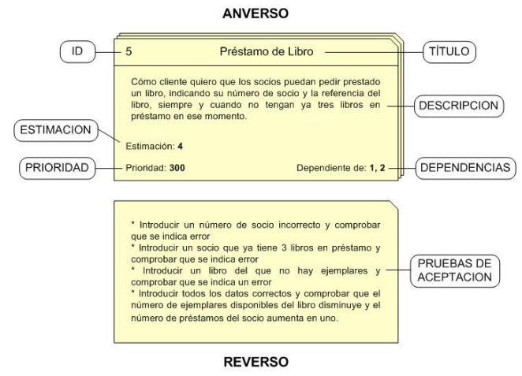

<div align="center">
    <br>
    <h1>Apuntes MDA</h1>
    <h3>Metodologia de Desarrollo Agiles</h3>
    <p>5º Ingenieria Informatica - ADE / UGR</p>
    <br>
    
    <br><br>
    <p>Nombre del Profesor: Maria Luisa</p>
    <p>Año Académico: 2023-2024</p>
    <br><br>
</div>


---
<div style="page-break-after: always;"></div>


## Indice
- [Indice](#indice)
- [Tema 1 - Desarrollando Software](#tema-1---desarrollando-software)
  - [Problemas del software](#problemas-del-software)
  - [La crisis del software](#la-crisis-del-software)
  - [Gestión Predictiva de Proyectos](#gestión-predictiva-de-proyectos)
  - [Procesos de desarrollo de software](#procesos-de-desarrollo-de-software)
    - [Etapas principales](#etapas-principales)
  - [La Ingeniería del Software](#la-ingeniería-del-software)
  - [Historia del desarrollo del software](#historia-del-desarrollo-del-software)
  - [Calidad en el software](#calidad-en-el-software)
  - [Project Management Institute (PMI)](#project-management-institute-pmi)
  - [Problemas del desarrollo de software](#problemas-del-desarrollo-de-software)
- [Tema 2 - Principios y Practicas Agiles](#tema-2---principios-y-practicas-agiles)
  - [Problemas de los Métodos Tradicionales](#problemas-de-los-métodos-tradicionales)
  - [Manifiesto Agil](#manifiesto-agil)
    - [Lo que principalmente se valora es:](#lo-que-principalmente-se-valora-es)
    - [Principal intención del manifiesto Ágil:](#principal-intención-del-manifiesto-ágil)
    - [Principios del Manifiesto Agil](#principios-del-manifiesto-agil)
    - [Agilidad](#agilidad)
    - [Contrato con el cliente](#contrato-con-el-cliente)
    - [Seguimiento del proyecto](#seguimiento-del-proyecto)
    - [Equipos Agiles](#equipos-agiles)
- [Seminario 1 – Las Personas y los Escenarios](#seminario-1--las-personas-y-los-escenarios)
  - [Metodo "Personas"](#metodo-personas)
  - [Personas](#personas)
    - [Guía de uso.](#guía-de-uso)
    - [Tipos de personas](#tipos-de-personas)
    - [Plantilla](#plantilla)
  - [Diseño Basado en Escenarios](#diseño-basado-en-escenarios)
    - [¿Que es un Escenario?](#que-es-un-escenario)
    - [¿Qué información necesitamos para describir el escenario?](#qué-información-necesitamos-para-describir-el-escenario)
    - [Descripción de la historia](#descripción-de-la-historia)
  - [Aplicación de Personas y Escenarios](#aplicación-de-personas-y-escenarios)
    - [1. Analizar los usuarios e identificar los **“prioritarios”**.](#1-analizar-los-usuarios-e-identificar-los-prioritarios)
    - [2. Introducirse en el mundo de los Usuarios.](#2-introducirse-en-el-mundo-de-los-usuarios)
    - [3. Buscar “Patrones de comportamiento”.](#3-buscar-patrones-de-comportamiento)
    - [4. Redefinir los grupos de usuarios.](#4-redefinir-los-grupos-de-usuarios)
    - [5. Descripcion de personas y escenarios de uso.](#5-descripcion-de-personas-y-escenarios-de-uso)
  - [¿Por qué usar Personas y Escenarios?](#por-qué-usar-personas-y-escenarios)
  - [¿Cuándo podemos usarlos?](#cuándo-podemos-usarlos)
- [Seminario 2 – Historias de Usuario](#seminario-2--historias-de-usuario)
  - [¿Qué son las HU?](#qué-son-las-hu)
    - [Objetivo de las HU](#objetivo-de-las-hu)
  - [¿Que no son las HU?](#que-no-son-las-hu)
    - [Diferencias entre **casos de uso e Historias de usuario**:](#diferencias-entre-casos-de-uso-e-historias-de-usuario)
  - [¿Quién escribe las HU?](#quién-escribe-las-hu)
    - [**Roles del sistema:**](#roles-del-sistema)
  - [Formato de una HU](#formato-de-una-hu)
    - [Elementos de una HU. “CCC”](#elementos-de-una-hu-ccc)
  - [Características de las HU](#características-de-las-hu)
  - [HU terminada](#hu-terminada)
  - [¿Por qué HU?](#por-qué-hu)
  - [Granularidad de las HU](#granularidad-de-las-hu)
  - [Requisitos funcionales](#requisitos-funcionales)
  - [Requisitos no funcionales](#requisitos-no-funcionales)
  - [Modelo I.N.V.E.S.T.](#modelo-invest)
  - [Pila de producto](#pila-de-producto)
  - [Proceso de definición de las HU](#proceso-de-definición-de-las-hu)
    - [Planning Poker](#planning-poker)
    - [Velocidad del equipo](#velocidad-del-equipo)
    - [Ejempo de Cálculo de Velocidad](#ejempo-de-cálculo-de-velocidad)
    - [Ejemplo descomposicion en tareas:](#ejemplo-descomposicion-en-tareas)
  - [Las HU SPIKE](#las-hu-spike)


<div style="page-break-after: always;"></div>

## Tema 1 - Desarrollando Software

El software es un transformador de información,
para ello: adquiere, gestiona, modifica, produce o
trasmite información. Aunque tambien forma parte del
software la **documentación** producida durante su
desarrollo.

Software = Programa de computadora

### Problemas del software 

- Mal funcionamiento (Calidad).
- Hay que mantener el volumen de software existente.
- Mantenimiento.
- Hay una demanda creciente de nuevo software.
- Adaptación a las nuevas tecnologías.
- Incremento de la complejidad.
- Requisitos incorrectos.

### La crisis del software

- El software es ineficiente.
- El software no satisface los requisitos.
- Los proyectos sobrepasan las estimaciones de tiempo y
recursos.
- Los proyectos se vuelven inmanejables y el software
imposible de mantener.

¿Como podemos solucionar esto?

### Gestión Predictiva de Proyectos

Un proyecto se ha desarrollado con exito si se consigue la finalidad prevista, con el presupuesto y en la fechas previstas.

Pasos:

- Partir de la descripción detallada de lo que hay que
hacer.
- Realizar un plan detallado del proyecto.
- Supervisar y coordinar la ejecución para evitar
desviaciones del plan.

### Procesos de desarrollo de software

Los modelos de ciclos de vida del software dividen dicho
desarrollo en unas etapas (Secuenciales y No Secuenciales)

#### Etapas principales

- **Planificación**: Estimar el tiempo y los costes de desarrollo del
software.
- **Especificación de requisitos**: Análisis del problema a resolver. Documento en el que se dice qué debe hacer el sistema software.
- **Diseño**: Búsqueda de la solución. Descripción de los componentes,
sus relaciones y funciones que dan solución al problema.
- **Implementación**: Traducción del diseño a un lenguaje de
programación entendible por una máquina.
- **Control de la calidad:** Debe realizarse durante todo el proceso de
desarrollo. Revisiones de todo lo que se va obteniendo junto con la prueba del código.
- **Mantenimiento o evolución**: Reparar fallos en el sistema cuando sean descubiertos o adaptar el software a los nuevos entornos.

### La Ingeniería del Software

Consiste en la aplicación de un enfoque sistemático, disciplinado y cuantificable para el desarrollo, operación y
mantenimiento del software.

### Historia del desarrollo del software

- 1970: Modelo en cascada
- 1980 - 1990: Modelos iterativos e incrementales
- 1984: Modelo basado en prototipos
- 1986: Modelo en espiral de Boehm
- 1991: Desarrollo rápido de aplicaciones (RAD)
- 1992: Crystal
- 1994: Dynamic Systems Development Method (DSDM)
- 1995: Scrum
- 1994-1995: Programación Extrema (XP)
- 1998: Proceso unificado (RUP)
  - Iterativo e incremental.
  - Dirigido por los casos de uso.
  - Centrado en la arquitectura.
  - Orientado a los riesgos.
  - Uso intensivo de UML.
- 2001: Manifiesto ágil
- 2005: Proceso Unificado Ágil (AUP)

### Calidad en el software

Objetivo: Desarrollar software de calidad, mejorando
procesos de desarrollo usados y el resultado final.

Calidad del Producto:
- Funcionalidad.
- Rendimiento.
- Compatibilidad.
- Usabilidad.
- Fiabilidad.
- Seguridad
- Mantenibilidad.
- Portabilidad.

Calidad de uso:
- Efectividad
- Productividad
- Seguridad
- Satisfaccion
- Contexto de Uso

### Project Management Institute (PMI)

Causas del fracaso de un proyecto:

- Problemas en el alcance.
- Comunicación pobre.
- Falta de implicación de los implicados
(stakeholders).
- Apoyo inadecuado del patrocinador del proyecto.

Puntos de mejora:
- Personas: Asignar los recursos necesarios y
suficientes, así como reconocer y desarrollar las
habilidades necesarias para desarrollar sus
funciones.
- Procesos: Estandarizar y formalizar los procesos.
- Cultura: Crear un sentimiento en todos los niveles
de la utilización de las prácticas elegidas.

### Problemas del desarrollo de software

- Detección de errores en etapas finales del proyecto.
- El cliente toma decisiones importantes en fases iniciales
del proyecto.
- Proyectos difíciles de gestionar.
- Reducción de calidad.
- Comunicación pobre.
- Insatisfacción del cliente, proyectos inflexibles.
- Dificultad para implantar metodologías de desarrollo.

---

<div style="page-break-after: always;"></div>


## Tema 2 - Principios y Practicas Agiles

### Problemas de los Métodos Tradicionales	

- No son buenos para entornos volátiles en los que los requisitos no son conocidos con exactitud (Incertidumbre y cambio).
- El cliente tiene que tomar muchas decisiones al principio (Costosas de cambiar y que no entiende).
- Los clientes piden más flexibilidad como solución a tomar decisiones pronto (Aumento de la complejidad del producto).
- El cliente toma decisiones con la información de las documentaciones técnicas. 

¿Pero que es lo importante?

* Producto: Excelencia Técnica o Satisfacción del cliente.
* Proceso de desarrollo: Acabar en tiempo y costo o maximizar el valor.

### Manifiesto Agil

#### Lo que principalmente se valora es:
- Individuos e interacciones sobre procesos y herramientas.
- Software funcionando sobre documentacion extensiva.
- Colaboracion con el cliente sobre negociacion contractual.
- Respuesta ante el cambio sobre seguir el plan.
  
#### Principal intención del manifiesto Ágil: 

- El movimiento Ágil no es ir en contra de las metodologías (no es un “anti-método”).
- El modelado y la documentación es importante pero no para generar recursos inútiles o poco usados.
- Es importante planificar y estimar pero hay que reconocer los problemas y las necesidades de gestión en “entornos turbulentos”.

#### Principios del Manifiesto Agil

1. **Satisfacer al cliente**, a traves de la entregar de software con valor.
2. **Requisitos cambian**, aprovechan el cambio para proporcionar ventaja competitiva al cliente.
3. **Entregar software funcional frecuentemente**.
4. **Cooperacion entre responsables de negocio y desarrolladores.**
5. **Individuos motivados**
6. **Comunicacion cara a cara**.
7. El **software funcionando es la medida principal** de progreso.
8. **Desarrollo sostenible y ritmo constante**.
9. **Atención** continua a la **excelencia técnica y al buen diseño.**
10. **Simplicidad**.
11.  **Equipos autoorganizados**.
12.  **Reflexionar y ajustar y perfeccionar**.

#### Agilidad

Definicion: Conjunto de mejores prácticas que permite la entrega rápida de software de alta calidad y un enfoque de negocio que alinea el desarrollo con las necesidades y los objetivos de las compañías.

Para la gestion de un proyecto, se necesitan un plan predictivo, y se compone de las siguientes partes:

- **Alcance** --> **Fijamos**	
(Funcionalidad,		
Características)	

- **Tiempo** --> **Estimamos**	
(Planificación,		
Fecha	final)	

- **Recursos** --> **Estimamos**
(Coste,	
Presupuesto)	

#### Contrato con el cliente

Acuerdo que establecemos con el cliente, un buen contrato aumenta las probabilidades de exito y los riesgos deberian ser compartidos.

¿Que debemos hacer en el contrato? --> Fijar las cosas.

#### Seguimiento del proyecto

- **Basado en objetivos**.
- Los **requisitos** se desarrollaran **priorizados** por el valor aportado al cliente.
- El **control** y **seguimiento** segun los **requisitos** **completados**.

#### Equipos Agiles

- Competencia
- Enfoque Comun.
- Colaboracion
- Toma de decisiones (Autonomia y Autoridad)
- Resolucion de problemas confusos (Adaptacion)
- Confianza y Respeto.
- Auto organizacion.

<div style="page-break-after: always;"></div>

## Seminario 1 – Las Personas y los Escenarios

### Metodo "Personas"

Una **persona** es una representación **ficticia** pero **concreta** del grupo de usuarios al que va dirigido un
producto. **Las personas son arquetipos de usuarios.**

Objetivos:

• **Compresión clara** de los **objetivos** y
**necesidades** de los **usuarios** en contextos
específicos de uso.

• **Instrumento** para la **ideación** y **validación** de soluciones o conceptos de diseño.

---

### Personas

#### Guía de uso.

- Las **personas** deben estar **basadas** en **observaciones** del mundo real.
- Es mejor centrarnos en las **metas de los usuarios**.
- **No son personas reales**, pero **representan** a **usuarios reales** durante el diseño y son descritos y usados con rigor.
- **Evitan** que el **diseñador proyecte** sobre el sistema sus
**propios** **objetivos** e **ideas**.
- **Usar** un **número** **manejables** de **personas**. 

#### Tipos de personas

- **Principales**: Representan usuarios con necesidades específicas
que sólo pueden ser satisfechas con una interfaz de usuario
diseñada específicamente para ellos.

- **Secundarias**: Son personas que también utilizan el sistema pero
que pueden utilizar la interfaz diseñada para una persona
principal.

- **Principio** de **diseño** de **Cooper**:
Cada persona principal debe tener una interface propia.

#### Plantilla

Las **Personas** se **representan** en **Plantillas**. Se deben incluir:
- Aspectos demográficos.
- Aspectos relacionados con el producto a desarrollar.
(Necesidades y objetivos).

Ejemplo de plantilla:


### Diseño Basado en Escenarios

#### ¿Que es un Escenario?

Un **Escenario** es un **descripción de una persona** usando un
**producto** para **alcanzar un objetivo**. Describe una instancia de uso de un producto o sistema en un
contexto determinado.

Se representa usando una narrativa que cuenta una historia.

Tipos de Escenarios:
- Escenarios **actuales**:

Peter acaba de llegar a la ciudad y necesita información sobre la
Facultad a la que tiene que ir al día siguiente.

- Escenarios **futuros**:

Peter está utilizando un dispositivo móvil que le puede localizar y
que le podría marcar, sobre un mapa, la mejor ruta a seguir para
llegar a la facultad.

- Escenarios de **prueba**:

Peter está en la Facultad y necesita hablar con un profesor, sabe
que el sistema le permite ver dónde está el despacho del profesor
y que tiene información en tiempo real sobre si está o no en su
despacho.
  
Todos los escenarios tienen que tener un objetivo determinado.

#### ¿Qué información necesitamos para describir el escenario?

- **Objetivos**: ¿Qué quiere conseguir el usuario?
- **Procesos**: ¿Qué pasos tiene que realizar el usuario?, ¿Qué
información usa y como fluye entre los procesos?
- **Entradas & Salidas**: ¿Qué información o material necesita el usuario para hacer de interface con el sistema?
- **Experiencia**: ¿Qué cosas similares ha realizado el usuario en el pasado?
- **Restricciones**: ¿Qué restricciones físicas , temporales o de negocio
se tienen que imponer el usuario?
- **Entorno físico**: ¿Qué necesita el usuario para hacer las tareas
asociadas al objetivo?, ¿Dónde va a realizar la actividad?
- **Herramientas a usar**: ¿Qué software y hardware usa actualmente
el usuario?
• **Relaciones**: ¿Existe alguna relación entre el usuario que realiza las tareas y otros personas que se vean afectadas por las tareas?

#### Descripción de la historia

- Usar un lenguaje sencillo.
- Evitar las referencias a la tecnología.
- Incluir referencias a aspectos relevantes del escenario aunque sean externos, como son los culturales, sociales...


Ejemplo de Plantilla de Escenario:


### Aplicación de Personas y Escenarios

#### 1. Analizar los usuarios e identificar los **“prioritarios”**.

Diseñar para tipos de usuarios específicos con
necesidades muy particulares.

#### 2. Introducirse en el mundo de los Usuarios.

* Observación de usuarios.
* Entrevistas, Cuestionarios y
Encuestas.
* Diarios de Uso.
* Análisis Etnográfico.
* Indagación en el contexto.

#### 3. Buscar “Patrones de comportamiento”.

Buscamos:
* Necesidades.
* Actividades.
* Motivaciones.
* Problemas.

Nos enfocamos en analizar:

• **Actividades**. Lo que el usuario hace; con qué frecuencia y en
qué cantidad.

• **Actitudes**. Qué piensa el usuario acerca del uso del producto
y la tecnología.

• **Aptitudes**. Qué educación y entrenamiento tiene el usuario;
cual es su habilidad para aprender.

• **Motivaciones**. Por qué el usuario está involucrado en el uso
del producto.

• **Habilidades**. Habilidades del usuario relacionadas con el uso
del producto y la tecnología. 

#### 4. Redefinir los grupos de usuarios.

#### 5. Descripcion de personas y escenarios de uso.

---

### ¿Por qué usar Personas y Escenarios?

• Sirven para comunicar y explorar soluciones de diseño.

• Son concretos pero suficientemente flexibles par
a acomodar
cambios y detalles según evoluciona el proyecto.

• Sirven para comprender el flujo de la experiencia y analizar el
diseño propuesto.

• Ayudan para presentar y situar la solución propuesta.

• Ayudan a identificar problemas potenciales.

• Fáciles de entender por todos (stakeholders) ya que son como una
“historia”.

• Incluyen información sobre el “contexto” (descripción de uso en
una situación concreta).

• Ayudan a analizar si la solución es la apropiada.

• Ayudan a detectar factores sociales.

---

### ¿Cuándo podemos usarlos?

• Como herramienta para explorar posibles soluciones.

• Para averiguar cuesYones que han sido supuestas en el
escenario.

• Durante el análisis de requisitos del software.

• Para validar soluciones y diseños y encontrar problemas junto
con los usuarios.

• Como soporte a la documentación de especificaciones y diseños
de las IU (wire-frames).

• Para generar las pruebas de los diseños finales (análisis de la
usabilidad).

• Si hacemos un “análisis de compeYdores”, para comparar
situaciones de uso entre diferentes sistemas.

<div style="page-break-after: always;"></div>

## Seminario 2 – Historias de Usuario

### ¿Qué son las HU?

Es una **descripción simple** de una tarea
concreta que aporta **valor al usuario** o al
negocio. Suelen obtenerse de las reuniones con
los **“stakeholders”**.

Se describen usando **tarjetas** (descripción
escrita en **lenguaje del negocio** que
identifica y recuerda el requisito y ayuda a
la priorización).

#### Objetivo de las HU

El objetivo de las HU es
principalmente, **lograr la interacción con el equipo y con el usuario**, por
encima de documentar los requisitos
que hay en el sistema.

---

### ¿Que no son las HU?

No es un requisito del sistema (algo que
el sistema deba hacer …..).

Hay que verlo más como algo negociable
(necesitaríamos hacer algo similar a esto
….)

#### Diferencias entre **casos de uso e Historias de usuario**:


---

### ¿Quién escribe las HU?

- **XP**: El **cliente**.

- **SCRUM**: **El Product Owner** (con ayuda
de clientes, stakeholders, equipo de
desarrollo).

- En la **realidad**: **Cualquier miembro del
equipo de desarrollo** con conocimiento
suficiente en el dominio del problema.

Hay que identificar y organizar a los
usuarios del sistema. (Roles o personas)

#### **Roles del sistema:**

- Podemos usar una sesión de
**“Brainstorming”** para definirlos.

- Definición de los roles. (Frecuencia de uso
del software, objetivos que se plantean,
forma habitual de acceso, etc.)

### Formato de una HU

Estructura principal: 

```java
Cómo [rol], Quiero [característica/objetivo] , Para [valor de negocio/beneficio]
```

[Cómo:] Quién es el usuario o grupo de usuarios que
participan en la historia, normalmente es un “rol de
usuario”, el que usará la funcionalidad” descrita por esta
historia.

[Quiero:] Es la actividad, el eje de la historia, qué hace el
usuario en la historia.

[Para:] Es el propósito de la historia, la meta que quiere
alcanzar el usuario al ejecutar la historia.

#### Elementos de una HU. “CCC”

- **Tarjeta (Card)**: Representa las 2-3 sentencias
usadas para describir la intención de la HU.

- **Conversación**: Detalles sobre la HU obtenidos
de la conversación con el usuario o cliente.

- **Confirmación**: Cómo el equipo confirmará que la
HU ha sido implementada (Test de aceptación). Se usan a dos niveles:
  - **Características** que se añaden a la tarjeta de la HU.
  - **Pruebas** que se usan para **demostrar** que la HU ha sido
correctamente desarrollada.
  - Aunque cualquiera puede escribir una prueba, el
**Product owner** es el **principal propietario de la prueba**.
  - Son **pruebas de caja negra**, solo se observa la **salida** del sistema para ver si **cumple** las **condiciones de satisfaccion**.
  - Podemos añadir pruebas de aceptación mientras
añadan valor y claridad a la HU.
  - Se podrían describir usando el formato (Behavior-Driven
Development):
    - **Dado** un sistema donde existe un usuario con
nombre “idprueba”.
    - **Cuando** alguien intenta registrarse con nombre
“idprueba”.
    - **Entonces** el sistema muestra un mensaje
indicando que el nombre “idprueba” ya existe.


¿Dónde están los detalles de las HU?

- Se describen en la conversaciones entre el
equipo y los usuarios.
[Conversación]
- Se delimita la parte a abordar por la HU
usando las “pruebas de aceptación”
[Confirmación]
  - Flujos alternativos en la actividad.
  - Límites de aceptación.
  - Pruebas de aceptación por parte de los clientes.

Ejemplo de Tarjeta de HU:



---

### Características de las HU

- Cortas y fáciles de leer.
- Representan incrementos pequeños de funcionalidad valorada.
- Son relativamente fáciles de estimar.
- Se gestionan en listas organizadas.
- Necesitan poco o ningún mantenimiento.

### HU terminada

Definir qué significa que una HU está
“terminada”. La definición de “terminado” es un
acuerdo de calidad entre los
desarrolladores y los clientes. Se puede establecer una definición de
“terminada” para todas las HU o un
“terminado” específico para algunas HU.

### ¿Por qué HU?

- Relacion cercana con el cliente.
- Se centra en aspectos relevantes actuales.
- Desarrollo oportunista.
- Trabajo iterativo.
- Buen tamaño para planificar y estimar.

### Granularidad de las HU

- **Temas**. Grandes proyectos, peticiones globales sin
más análisis ni detalles. Subproductos.
```
Planificador de viajes, gestor de ofertas de hoteles, sitio Web para socios.
```

- **Épicas**. Súper historias de usuario, más concretas que los
Temas. Conjunto de HU relacionadas entre sí. 
```
Sistema de búsqueda para hoteles, anotador de satisfacción de instalaciones y viajes, filtros aplicados a las búsquedas, comparador avanzado de ofertas.
```
- **Historias de Usuario**. Una manera simple de describir una
tarea concisa que aporta valor.

```
Como cliente quiero buscar un hotel en una localidad determinada, como cliente quiero obtener un viaje una zona determinada y bajo un rango de precios, como socio quiero pagar la reserva de mi viaje usando una tarjeta de crédito.
```

- **Tareas**. Las HU pueden ser divididas en diversas tareas por
necesidades técnicas o de desarrollo.

```
Crear la pantalla de presentación de resultados de la búsqueda de hoteles, crear los métodos de consulta a BBDD para que retornen resultados, mostrar mensaje si no se encuentran
resultados con los criterios de búsqueda, probar integración del modulo de socios con el sitio Web.
```

### Requisitos funcionales

Describen cualidades o restricciones del
sistema que no se relacionan de forma
directa con el comportamiento funcional del
mismo.

Se pueden aplicar:
- Al sistema o producto en su conjunto.
- A determinadas funciones o características
del sistema.

### Requisitos no funcionales

Los RNF pueden tratarse como:
- Restricciones asignadas a cualquiera de los
elementos que tratamos en las pilas de
desarrollo (Temas, Épicas, HU y Tareas).
- Criterios de aceptación.
- Como parte de la definición de terminada
(done).
- Documento de especificación específico para
los requisitos no funcionales globales al
sistema

### Modelo I.N.V.E.S.T.

- **Independiente**: Una historia debería ser independiente de otras (lo más
posible).
- **Negociable**: Las HU no son un contrato o un requerimiento que el software
debe implementar.
- **Valiosa**: Tiene que tener valor para el cliente (para el usuario o para el
comprador). El cliente las escribe, no son un contrato y son negociables.
- **Estimable**: Para permitir que se pueda priorizar y planificar la historia.
- **Suscinta**: Una buena historia debe ser pequeña en esfuerzo (2-3
personas/semana de trabajo).
- **Testeable**: Una historia necesita poder probarse para que ocurra la etapa
de "Confirmación".

### Pila de producto

Lista priorizada de HU que contiene toda la
funcionalidad deseable del producto.

Prioridad. Valor que le da el cliente a la HU.

Cubre todas las funcionalidades necesarias. Se revisa/actualiza frecuentemente. Es una herramienta de planificación y gestión.

### Proceso de definición de las HU

1. Toma de requisitos en reuniones con usuarios/clientes
(Entrevistas, cuestionarios, observación).

2. Informar de la visión general transmitida por el cliente.

3. Crear HU (reuniones de escritura de HU).

4. Actuar sobre cada HU mediante un estudio funcional y
técnico realizado en equipo (Conversación).

5. Definir criterios de aceptación.

6. Estimar el tamaño de las HU para priorizarlas [2]:

**Puntos de Historia:** Tamaño relativo de una historia
comparado con otras historias estimadas por el
mismo equipo.(esfuerzo necesario + complejidad +
riesgo + …).

**Días ideales**: Un día de trabajo sin interrupciones.

#### Planning Poker

Técnica para realizar una estimación en base al
consenso entre los estimadores. Tipico uso de la Secuencia de Fibonacci.

7. Priorizar las HU:

• **Requeridas o críticas.** Sin las cuales la solución no puede vivir
(entregas primeras del proyecto).

• **Importantes**. Sin las cuales el sistema puede vivir durante algún
tiempo (entregas intermedias del proyecto).

• **Opcionales**. Si hay tiempo y presupuesto se construyen.
(entregas finales del proyecto).

• **No se construirán**. Por restricciones de presupuesto o de tiempo
o no tienen ningún valor para el negocio.

Tambien a través del metodo MoSCoW: [Must, Should, Could, Would].

#### Velocidad del equipo
Es la cantidad de puntos de historia que
un equipo puede completar en una
iteración. Permite planificar las HU que se
abordaran en una iteración.

#### Ejempo de Cálculo de Velocidad

Partimos de un equipo de desarrollo de 5 miembros. Las iteraciones las vamos a realizar de 2 semanas.

1 iteración = 10 días de trabajo

En nuestro entorno de trabajo estimamos que:

1 PH = 1 día de trabajo ideal

Todos los miembros del equipo trabajan las mismas horas.
La velocidad del equipo de trabajo:

5 programadores * 10 días de trabajo = 50 días de trabajo por iteración

Vamos a considerar un factor de dedicación del 80 %

Velocidad = 50 * 80% =40 PH

8. Descomponer las HU en tareas [3].

- Las HU hay que descomponerlas en tareas
que puedan ser tratadas de forma individual
por el equipo de desarrollo.
- La duración de una tareas debe estar entre
medio día a 3 ó 4 días de trabajo.
- Incluir tareas de prueba y automatización.

#### Ejemplo descomposicion en tareas:

HU: Como administrador quiero poder realizar un
mantenimiento de los clientes de la empresa.

– Construir la IU.

– Construir la lógica de negocio.

– Construir la capa de datos.

---

– Implementar añadir usuario.

– Implementar modificar usuario.

– Implementar eliminar usuario.

– Realizar pruebas de añadir/modificar/eliminar usuario.

### Las HU SPIKE

Tipo de HU usada para gestionar una dificultad técnica. Tiempo
necesario para reducir un riesgo o una incertidumbre de un problema
técnico o para aumentar la seguridad sobre una estimación de una HU.

Tipos:

- **SPIKE Técnico**: Analizar varias aproximaciones técnicas en el dominio
de la solución del problema.

- **SPIKE Funcional:** Si hay una incertidumbre importante en cómo el
usuario debe interactuar con el sistema.