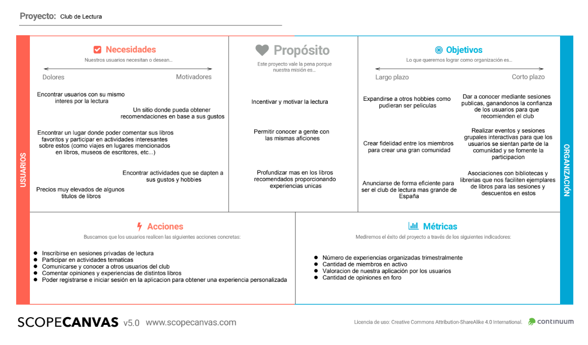
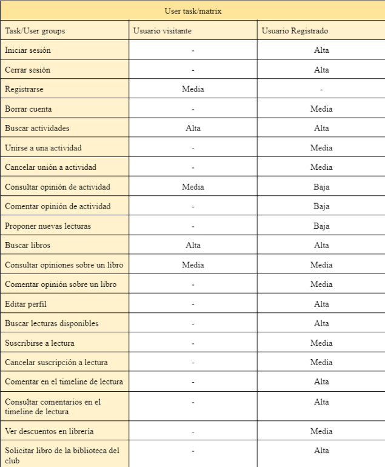
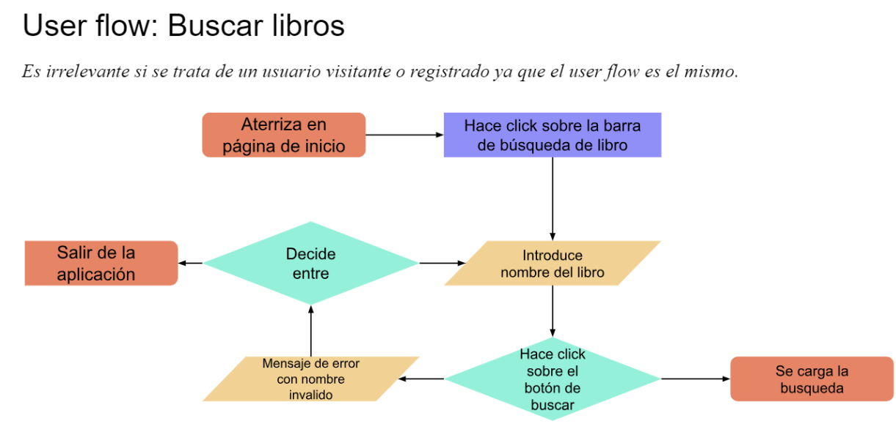
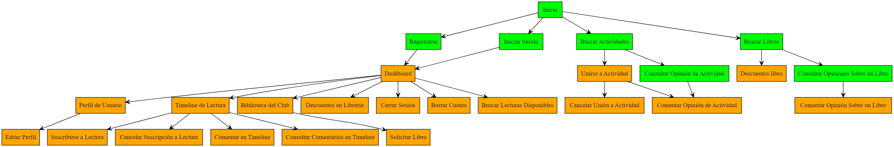
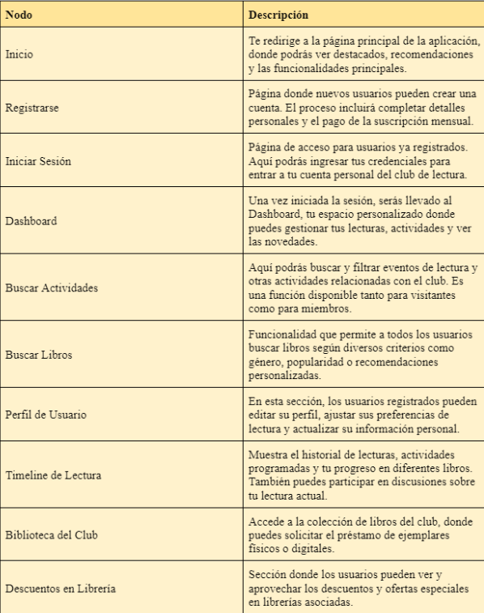
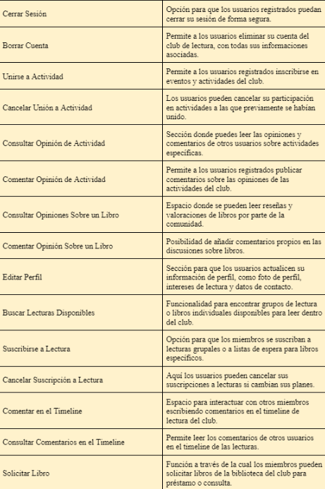

## DIU - Practica2, entregables

### Ideación 

>>> Tras un profundo análisis de las necesidades y percepciones de los usuarios, basado en el método de mapeo de empatía, se ha rediseñado la aplicación web de rutas vinícolas (https://rutadelosvinosdegranada.com/) para ofrecer una experiencia altamente personalizada y comunitaria. 

>>> Reconociendo la importancia de la interacción y la creación de contenido por parte de los usuarios, la nueva plataforma permite a cada individuo tener su perfil personal con el cual puede interactuar con otros miembros, compartir experiencias, y organizar o unirse a actividades según sus intereses. 

>>> Este enfoque responde directamente a la necesidad de los usuarios de tener un espacio que se ajuste a su ritmo de vida y gustos personales, fomentando así una participación activa y el sentido de comunidad.

>>> Además, se ha puesto especial énfasis en mejorar la función de búsqueda, integrando un apartado destacado en la cabecera de la aplicación para facilitar el acceso a la información deseada de manera rápida y eficiente. 

>>> La funcionalidad de recomendación de tours ha sido refinada para ofrecer sugerencias personalizadas basadas en las experiencias previas de los usuarios, mejorando significativamente la relevancia de las opciones presentadas y enriqueciendo la experiencia de cada usuario. 

>>> Estas mejoras se fundamentan en la comprensión de que los usuarios valoran una plataforma adaptable, que les permita explorar y disfrutar de actividades a su propio ritmo, en un entorno seguro y acogedor, tal como se reveló en el estudio de empatía centrado en las experiencias de lectura, pero aplicable al contexto de tours y actividades.

Adjunto el documento: [Empathy Map](Empathy%20Map.pdf)

### PROPUESTA DE VALOR

>>> Nuestro Club de Lectura se posiciona como un punto de encuentro innovador para los entusiastas de los libros. Nuestra propuesta de valor reside en crear un ecosistema literario que enriquezca la experiencia del lector mediante la personalización, la interacción social y el acceso a un vasto repertorio de recursos. 

>>> La plataforma actúa como un catalizador que no solo recomienda libros basados en inteligencia artificial y preferencias personales sino que también facilita discusiones profundas y significativas entre sus miembros. Con cada libro descubierto y discutido, se fortalece el lazo entre los usuarios, creando una comunidad literaria robusta y diversa.

>>> El Club de Lectura es un espacio seguro y respetuoso, donde los miembros pueden expresar sus opiniones, compartir análisis y descubrir perspectivas únicas de otros lectores apasionados. La funcionalidad de programar y participar en encuentros permite a los usuarios organizar sus sesiones de acuerdo con su propio ritmo y disponibilidad.

>>> Además, ofrecemos rutas literarias, invitando a los usuarios a explorar lugares de interés tanto históricos como contemporáneos, vinculados con obras literarias y autores. En un nivel más práctico, la aplicación está diseñada para ser intuitiva y accesible, asegurando que la tecnología potencie y no obstaculice la experiencia lectora. 

Adjunto el documento: [Propuesta de Valor](./Propuesta%20de%20Valor.pdf)

### TASK ANALYSIS

* User task Matrix:

* User flow:

Adjunto el documento: [Task Analysis](./Task%20Analysis.pdf)

### ARQUITECTURA DE INFORMACIÓN

* Sitemap:

* Labelling:

Adjunto el documento: [Labelling](./Labelling.pdf)

### Prototipo Lo-FI Wireframe 

### Conclusiones  

La práctica 2 de DIU nos ha permitido profundizar en el entendimiento de nuestras audiencias objetivo a través del desarrollo de un mapa de empatía, lo cual ha guiado la ideación y el rediseño de la aplicación de Club de Lectura, ahora enfocada en la experiencia de lectura. La estructura y las funcionalidades detalladas en el documento de etiquetado han sido diseñadas con el fin de crear una experiencia altamente personalizada y comunitaria, respondiendo directamente a las necesidades y deseos de nuestros usuarios.

