<style>
body {
    font-family: "Times New Roman", Times, serif;
}

/* Ocultar la cabecera */
.header {
    display: none;
}

/* Ocultar el pie de página */
.footer {
    display: none;
}

</style>

<div align="center">

# Memoria Práctica 1
## Servidores Web de Altas Prestaciones  
*David Martínez Díaz*  
Curso 2023-2024  
4º Ingeniería Informática  

</div>


<div style="page-break-after: always;"></div>

# Índice
- [Memoria Práctica 1](#memoria-práctica-1)
  - [Servidores Web de Altas Prestaciones](#servidores-web-de-altas-prestaciones)
- [Índice](#índice)
  - [1. Tareas Básicas](#1-tareas-básicas)
    - [**Tareas Básicas - B1. Configuración del Entorno**](#tareas-básicas---b1-configuración-del-entorno)
      - [**Análisis propuesta IA**](#análisis-propuesta-ia)
    - [**Tareas Básicas - B2. Creación del Dockerfile**](#tareas-básicas---b2-creación-del-dockerfile)
      - [**Análisis propuesta IA**](#análisis-propuesta-ia-1)
    - [**Tareas Básicas - B3. Configuración con Docker Compose**](#tareas-básicas---b3-configuración-con-docker-compose)
      - [**Análisis propuesta IA**](#análisis-propuesta-ia-2)
    - [**Tareas Básicas - B4. Verificación y Pruebas**](#tareas-básicas---b4-verificación-y-pruebas)
      - [**Análisis propuesta IA**](#análisis-propuesta-ia-3)
    - [**Tareas Básicas - B5. Probar la Página Web**](#tareas-básicas---b5-probar-la-página-web)
      - [**Análisis propuesta IA**](#análisis-propuesta-ia-4)
  - [1. Tareas Avanzadas](#1-tareas-avanzadas)
    - [**Tareas Avanzadas - A1. Personalización del Dockerfile**](#tareas-avanzadas---a1-personalización-del-dockerfile)
      - [**Análisis propuesta IA**](#análisis-propuesta-ia-5)
    - [**Tareas Avanzadas - A2. Creación de contendores con otros servidores web**](#tareas-avanzadas---a2-creación-de-contendores-con-otros-servidores-web)
      - [**Análisis propuesta IA**](#análisis-propuesta-ia-6)
    - [**Tareas Avanzadas - A3. Gestión Avanzada de Redes:**](#tareas-avanzadas---a3-gestión-avanzada-de-redes)
      - [**Análisis propuesta IA**](#análisis-propuesta-ia-7)
    - [**Tareas Avanzadas - A4. Automatización con Scripts:**](#tareas-avanzadas---a4-automatización-con-scripts)
      - [**Análisis propuesta IA**](#análisis-propuesta-ia-8)
    - [**Tareas Avanzadas - A5. Monitoreo y Logging:**](#tareas-avanzadas---a5-monitoreo-y-logging)
      - [**Análisis propuesta IA**](#análisis-propuesta-ia-9)

<div style="page-break-after: always;"></div>

---

## 1. Tareas Básicas

### **Tareas Básicas - B1. Configuración del Entorno**

Como ya tengo instalado Docker y Docker Compose, no he tenido que realizar ningún comando en esta parte. Por tanto, he comenzado directamente creándome el directorio específico donde se desarrollará la práctica.

Dicho comando es el siguiente:


Una vez creado el directorio, accedí a dicha carpeta con este comando:

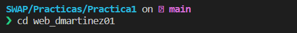

Una vez nos encontramos en el directorio, me cree el archivo "index.php", el cual está diseñado para mostrar el nombre de la asignatura y el nombre del usuario. 

Así como la dirección IP del servidor Apache que sirve la aplicación. Adjunto la serie de comandos utilizados para esta parte:

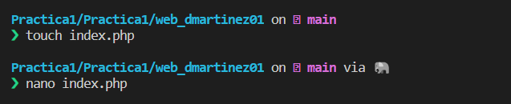

Y el código implementado en **index.php**:

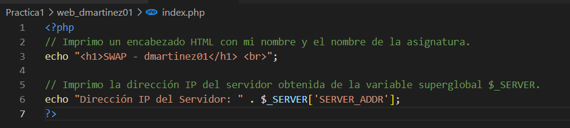

<div style="page-break-after: always;"></div>

#### **Análisis propuesta IA**

En cuanto a los comandos de creación del directorio y del archivo, me proporcionó lo mismo a lo que yo había pensado, porque no creo que haya muchas más soluciones para este caso:

```bash
mkdir web_dmartinez01
cd web_dmartinez01
touch index.php
nano index.php
```

Sin embargo, si podemos apreciar una diferencia en la elaboración del documento **index.php**, ya que la inteligencia artificial muestra también la zona horaria del servidor y no esta especificado el nombre de usuario:

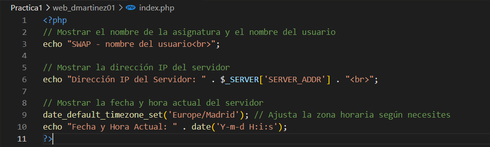

---

<div style="page-break-after: always;"></div>

### **Tareas Básicas - B2. Creación del Dockerfile**

Para la segunda parte, continuaré creándome el correspondiente archivo **DockerfileApache_dmartinez01** con el siguiente comando:

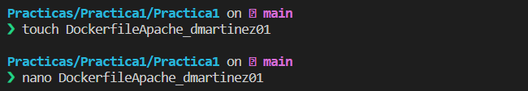

Una vez creado me meto dentro del archivo utilizando el comando **"nano"** e introduzco el siguiente código:

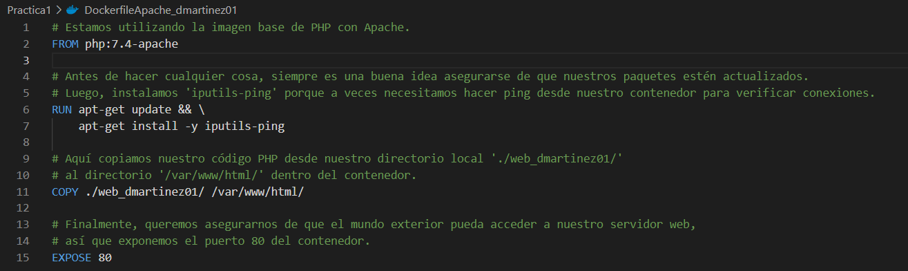

La primera línea de este archivo sirve para establecer la base que se utilizará para construir la imagen, que en este caso se trata de la imagen oficial de PHP con Apache.

Luego tenemos el comando **"RUN"**, el cual se encarga de ejecutar esos comandos durante la construcción de la imagen. Se puede ver como se instala el paquete **"iputils-ping"** para que podamos hacer ping entre los distintos servidores.

En cuanto al comando **"COPY"**, hace que se copien los archivos del directorio actual, en este caso **"web_dmartinez01"** al directorio **"var/www/html/"** dentro del contenedor

Y, por último, la última línea del archivo sirve para exponer el puerto 80, con el que podremos acceder al contenedor, el cual es el que se utiliza por defecto con Apache.


#### **Análisis propuesta IA**

En cuanto a lo propuesto por la inteligencia artificial, podemos ver que para crear el archivo **"Dockerfile"**, utiliza los mismos comandos que yo he propuesto, ya que tampoco nos podemos desviar mucho de la solución.

```bash
touch Dockerfile
nano Dockerfile
```

Sin embargo, en cuanto al interior del archivo **"Dockerfile"**, otra vez, a diferencia de la configuración básica propuesta, esta incluye pasos adicionales para asegurar que el entorno del contenedor esté correctamente configurado para reflejar el entorno de producción o desarrollo deseado, incluyendo ajustes de zona horaria y herramientas de red:

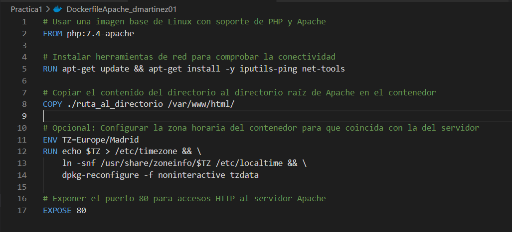


---

<div style="page-break-after: always;"></div>

### **Tareas Básicas - B3. Configuración con Docker Compose**

Tras finalizar la configuración del Dockerfile, el siguiente paso es la creación y configuración del archivo docker-compose.yml. Este archivo nos permitirá definir y ejecutar aplicaciones multi-contenedor de Docker.

Para ello utilizaré estos comandos:

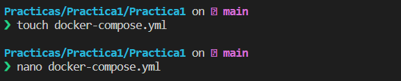


Y dentro del archivo **"docker-compose.yml"**, introduzco el siguiente código:


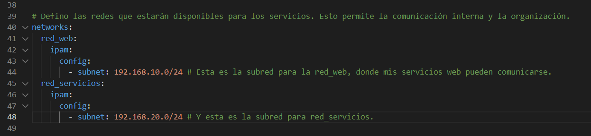


Cada servicio, como web1, web2, etc., está configurado para construir una imagen de contenedor utilizando un archivo Dockerfile específico (DockerfileApache_dmartinez01). 

Cada servicio utiliza la misma imagen (dmartinez01-apache-image:p1) para ejecutar un servidor Apache. Además, se establecen volúmenes para vincular directorios locales con directorios dentro de los contenedores.

También se configuran redes específicas (red_web y red_servicios) con rangos de direcciones IP asignadas, permitiendo una comunicación estructurada entre los contenedores. Por último, se mapean los puertos del host a los puertos del contenedor, permitiendo acceder a los servicios web a través de diferentes puertos en el host para evitar conflictos.

#### **Análisis propuesta IA**

Aquí si podemos ver una clara diferencia, donde la inteligencia artificial me recomienda definir un único servicio web y además utiliza la configuración de despliegue (deploy) para crear múltiples réplicas del servicio web. Siendo mi solución con una tendencia a la fuerza bruta, y la de la IA con más elegancia y limpieza.

```yml
version: '3.8'

services:
  web:
    image: dmartinez01-apache-image:p1
    build:
      context: .
      dockerfile: DockerfileApache_dmartinez01
    volumes:
      - type: bind
        source: ./web_dmartinez01
        target: /var/www/html
    networks:
      - red_web
      - red_servicios
    deploy:
      replicas: 8
      update_config:
        parallelism: 2
        delay: 10s
      restart_policy:
        condition: on-failure

networks:
  red_web:
    driver: bridge
    ipam:
      config:
        - subnet: 192.168.10.0/24
  red_servicios:
    driver: bridge
    ipam:
      config:
        - subnet: 192.168.20.0/24
```

Donde se puede ver cómo define los distintos servicios **"web"**, los cuales utilizarán como imagen apache como se puede ver en la etiquite de **"image"**.

Por otro lado, también indica como se deben construir las imágenes, que para ello utilizarán el **"Dockerfile"** previamente definido. 

Además, define los volúmenes de tipo "bind", que básicamente consisten en montar un directorio del host (source: ./web_dmartinez01) en el contenedor en la ruta /var/www/html.

Para la sección "deploy" ha implementado lo siguiente:

- "replicas: 8", lo que indica que se deben crear 8 réplicas del servicio web.
- "update_config", que configura cómo se actualiza el servicio.
  - "parallelism: 2", especifica cuántas réplicas pueden actualizarse simultáneamente durante una actualización.
  - "delay: 10s", indica cuánto tiempo esperar antes de actualizar el siguiente conjunto de réplicas.
- "restart_policy", define la política de reinicio del servicio.
  - "condition: on-failure", que indica que el servicio se reiniciará automáticamente si falla.
  
Con la sección networks indica a qué redes pertenece el servicio, en nuestro caso, vemos que estos servidores tienen dos redes, **"red_web"** y **"red_servicios"**.

En cuanto a los **"networks"**, aquí es donde se definen las redes que serán utilizadas por los servicios. 

---

<div style="page-break-after: always;"></div>

### **Tareas Básicas - B4. Verificación y Pruebas**

Una vez tenemos ya todos los archivos configurados, debemos comprobar si funcionan correctamente nuestros servidores, para ello emplearé el siguiente comando:

```bash
Practicas/Practica1/web_dmartinez01 on  main via 🐘 
❯ docker-compose up
[+] Running 0/1
 ⠿ web Warning                                                                                                                                                              1.7s
[+] Building 28.6s (8/8) FINISHED
```

Este comando llama a Docker Compose para que inicie todos los servicios que he definido en el docker-compose.yml. Y para verificar que todos los contenedores están en ejecución, utilizare el comando **"docker ps"**:

```bash
SWAP/Practicas/Practica1 on  main
❯ docker ps
CONTAINER ID   IMAGE                         COMMAND                  CREATED         STATUS         PORTS     NAMES
71de981fee91   dmartinez01-apache-image:p1   "docker-php-entrypoi…"   3 minutes ago   Up 3 minutes   80/tcp    practica1-web-2
6bb15732e424   dmartinez01-apache-image:p1   "docker-php-entrypoi…"   3 minutes ago   Up 3 minutes   80/tcp    practica1-web-1
ec07aa9b8c8c   dmartinez01-apache-image:p1   "docker-php-entrypoi…"   3 minutes ago   Up 3 minutes   80/tcp    practica1-web-4
83b0682d13b8   dmartinez01-apache-image:p1   "docker-php-entrypoi…"   3 minutes ago   Up 3 minutes   80/tcp    practica1-web-6
72ac7b6d1218   dmartinez01-apache-image:p1   "docker-php-entrypoi…"   3 minutes ago   Up 3 minutes   80/tcp    practica1-web-5
022cd9b4243a   dmartinez01-apache-image:p1   "docker-php-entrypoi…"   3 minutes ago   Up 3 minutes   80/tcp    practica1-web-7
1ad764fd39c7   dmartinez01-apache-image:p1   "docker-php-entrypoi…"   3 minutes ago   Up 3 minutes   80/tcp    practica1-web-3
9ae2339299f6   dmartinez01-apache-image:p1   "docker-php-entrypoi…"   3 minutes ago   Up 3 minutes   80/tcp    practica1-web-8
```

Y podemos ver que todos están corriendo perfectamente en el puerto 80. Por tanto, ahora ya podemos comprobar si todos los contenedores tienen las redes bien asignadas, para ello nos meteremos en cada contenedor como hicimos en la Practica 0:


```bash
SWAP/Practicas/Practica1 on  main
❯ docker exec -it practica1-web-1 bash
```

Y nos instalamos los paquetes necesarios para hacer las comprobaciones de configuración de la red:

```bash
root@6bb15732e424:/var/www/html# apt-get update && apt-get install -y inetutils-ping \
iproute2 \
dnsutils
Hit:1 http://deb.debian.org/debian bullseye InRelease
Hit:2 http://deb.debian.org/debian-security bullseye-security InRelease
Hit:3 http://deb.debian.org/debian bullseye-updates InRelease
Reading package lists... Done
Reading package lists... Done
```

Una vez esta todo instalado, simplemente utilizamos el comando **"ip a"** para comprobar que los servidores están conectados a las dos redes y tiene las direcciones que hemos indicado:

```bash
root@a1d81b7d2e30:/var/www/html# ip a
1: lo: <LOOPBACK,UP,LOWER_UP> mtu 65536 qdisc noqueue state UNKNOWN group default qlen 1000    
    link/loopback 00:00:00:00:00:00 brd 00:00:00:00:00:00
    inet 127.0.0.1/8 scope host lo
       valid_lft forever preferred_lft forever
13: eth0@if14: <BROADCAST,MULTICAST,UP,LOWER_UP> mtu 1500 qdisc noqueue state UP group default 
    link/ether 02:42:c0:a8:14:09 brd ff:ff:ff:ff:ff:ff link-netnsid 0
    inet 192.168.20.9/24 brd 192.168.20.255 scope global eth0
       valid_lft forever preferred_lft forever
27: eth1@if28: <BROADCAST,MULTICAST,UP,LOWER_UP> mtu 1500 qdisc noqueue state UP group default 
    link/ether 02:42:c0:a8:0a:09 brd ff:ff:ff:ff:ff:ff link-netnsid 0
    inet 192.168.10.9/24 brd 192.168.10.255 scope global eth1
       valid_lft forever preferred_lft forever
```

Y podemos ver que tiene ambas direcciones ip correctamente tanto la de **"red_web (192.168.10.0/24)"** como la de **"red_servicios (192.168.20.0/24)"**.

Para verificar la conectividad entre los distintos contenedores una vez que hemos confirmado que todo está configurado correctamente, realizaremos un ping entre los servidores.

Dado que el servidor web 7 tiene la siguiente dirección, probaremos la conectividad hacia él utilizando el comando ping:

```bash
web_dmartinez01-web-7  | AH00558: apache2: Could not reliably determine the server's fully qualified domain name, using 192.168.10.7. Set the 'ServerName' directive globally to suppress this message
```
```bash
root@6bb15732e424:/var/www/html# ping 192.168.10.7
PING 192.168.10.7 (192.168.10.7): 56 data bytes
64 bytes from 192.168.10.7: icmp_seq=0 ttl=64 time=1.013 ms
64 bytes from 192.168.10.7: icmp_seq=1 ttl=64 time=0.065 ms
64 bytes from 192.168.10.7: icmp_seq=2 ttl=64 time=0.070 ms
64 bytes from 192.168.10.7: icmp_seq=3 ttl=64 time=0.085 ms
64 bytes from 192.168.10.7: icmp_seq=4 ttl=64 time=0.066 ms
^C--- 192.168.10.7 ping statistics ---
5 packets transmitted, 5 packets received, 0% packet loss
```

Por lo que vemos que la conectividad es correcta en este caso.

#### **Análisis propuesta IA**

En cuanto a los resultados obtenidos por la inteligencia artificial, para los comandos principales no ha habido mucha diferencia, por ejemplo, para lanzar los contenedores:

```bash
docker-compose up -d
```
Me ha agregado el flag **-d**, que sirve para lanzarlo en el background. Para verificar que todos los contenedores están en ejecución utiliza el mismo comando:

```bash
docker ps
```

Sin embargo, para comprobar la asignación de la IP en las redes, lo hace manera distinta, utilizando el comando **"docker inspect web1 | grep "IPAddres"**, el cual he probado a utilizarlo, pero no consigo acceder a dicho campo de direcciones IP:

```bash
SWAP/Practicas/Practica1 on  main took 13m39s
❯ docker inspect dmartinez01-apache-image:p1 | grep "IPAddress"

SWAP/Practicas/Practica1 on  main
❯
```

No obstante, si no utilizo el pipe con el grep obtengo un montón de información respecto al contenedor:

```bash
SWAP/Practicas/Practica1 on  main
❯ docker inspect dmartinez01-apache-image:p1 
[
    {
        "Id": "sha256:05896c7146de9f23b1f5c2a0e1c05a84a03f176ab9932c789a77959e386f8591",
        "RepoTags": [
            "dmartinez01-apache-image:p1"
        ],
        "RepoDigests": [],
        "Parent": "",
        "Comment": "buildkit.dockerfile.v0",
        "Created": "2024-03-22T16:54:52.382855492Z",
        ... etc
```

Y para comprobar el uso del ping si lo hace de manera parecida:

```bash
docker exec -it web1 ping [IP_DEL_OTRO_CONTENEDOR]
```
---

<div style="page-break-after: always;"></div>

### **Tareas Básicas - B5. Probar la Página Web**

Al finalizar la configuración y despliegue de nuestros contenedores, el siguiente paso esencial es verificar si tenemos acceso a las páginas web de cada contenedor utilizando sus direcciones IP asignadas previamente y asegurarnos de que la información mostrada es la correcta. 

Comenzamos con el primer contenedor, donde al acceder a su página web a través de la dirección IP que le asignamos podemos ver que todo está de manera correcta:

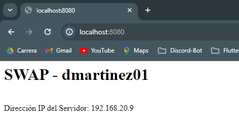

Procediendo con la misma metodología, nos dirigimos a verificar el segundo contenedor. 

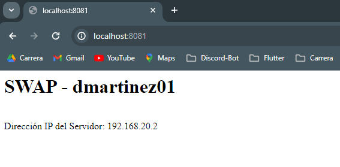

La captura de pantalla del segundo contenedor nos indica que, al igual que con el primero, la página web es accesible, y la información mostrada es la esperada según nuestra configuración.

#### **Análisis propuesta IA**

Aquí no tiene sentido preguntarle a la inteligencia artificial.

<div style="page-break-after: always;"></div>

---

## 1. Tareas Avanzadas

### **Tareas Avanzadas - A1. Personalización del Dockerfile**

Una vez completada la configuración básica de la estructura de nuestra granja de servidores, avanzamos hacia la optimización y personalización de nuestro archivo Dockerfile. 

Para ello, comenzamos creando una carpeta denominada "config" destinada a alojar todos los archivos de configuración que necesitaremos.

```bash
Practicas/Practica1/Practica1 on  main
❯ mkdir config
```

Y nos creamos el primer archivo de configuración, el cual sera **"apache2.conf"**, que nos permitirá controlar algunas configuraciones globales de los servidores Apache:

```bash
Practicas/Practica1/Practica1 on  main
❯ cd config

Practica1/Practica1/config on  main
❯ touch apache2.conf

Practica1/Practica1/config on  main
❯ nano apache2.conf
```

En el archivo "apache2.conf", incorporamos el siguiente código para definir la configuración deseada:

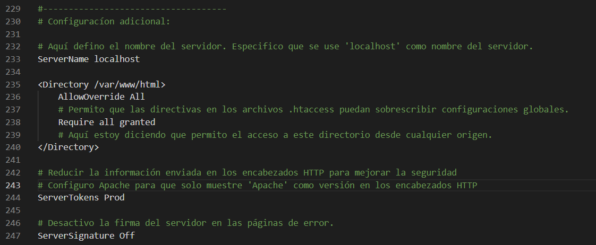

Este código lo que hacer es configurar el nombre del servidor como "localhost" y establece permisos adecuados para el directorio raíz del servidor web (/var/www/html). 

Además, implementa medidas de seguridad para reducir la información enviada en los encabezados HTTP, lo que contribuye a mejorar la seguridad del servidor Apache en nuestros contenedores Docker.

Sin embargo, esto me provoca un problema, y me salta este error cuando intento iniciar los contenedores:

```bash
practica1-web1-1  | AH00534: apache2: Configuration error: No MPM loaded.
practica1-web3-1  | AH00534: apache2: Configuration error: No MPM loaded.
practica1-web7-1  | AH00534: apache2: Configuration error: No MPM loaded.
practica1-web6-1  | AH00534: apache2: Configuration error: No MPM loaded.
practica1-web1-1 exited with code 1
```

Me está diciendo que Apache no está cargando ningún Multi-Processing Module (MPM), lo cual es necesario para su funcionamiento. Y esto se debe a que estoy cambiando el archivo de configuración que se crea por defecto, por el mío, omitiendo algunas opciones de configuración bastante importantes para la construcción de los contenedores. 

Para solucionarlo, obtendré el archivo de configuración predeterminado creándome un contenedor y obteniéndolo:

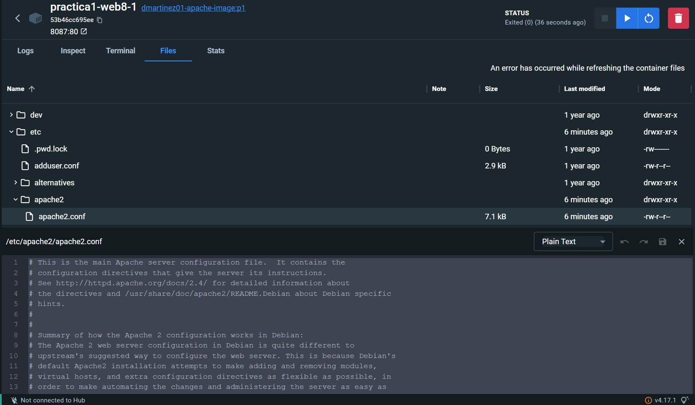

Y ya utilizando el código predeterminado y añadiendo al final dichas líneas, ya si funciona correctamente.

Pero si queremos ajustar configuraciones mas específicas en cuanto a la seguridad de nuestros servidores, podemos crearnos el archivo **"security.conf"**, que nos dará una mayor flexibilidad para ello:

```bash
Practica1/Practica1/config on  main
❯ touch security.conf

Practica1/Practica1/config on  main
❯ nano security.conf
```

He introducimos lo siguiente:

```sh
<IfModule mod_headers.c>
    # Prevenir ataques de clickjacking
    Header always append X-Frame-Options SAMEORIGIN
    # Prevenir ataques basados en MIME type
    Header set X-Content-Type-Options nosniff
</IfModule>
```

Esto lo que hace es prevenir ciertos ciberataques, en primer lugar, se incluye una directiva que evita los ataques de clickjacking al agregar el encabezado X-Frame-Options a todas las respuestas del servidor. Este encabezado indica a los navegadores web que solo permitan mostrar páginas en un marco si provienen del mismo origen, reduciendo así la posibilidad de que los usuarios sean engañados para realizar acciones no deseadas. 

En segundo lugar, se establece otra directiva que previene ataques basados en el tipo MIME al configurar el encabezado X-Content-Type-Options en "nosniff", lo que instruye a los navegadores a no realizar la detección automática del tipo MIME de los archivos servidos. 

Y por último, voy a crearme un archivo de configuración para php **"php.ini-production"**, con el siguiente código:

```sh
# Muestra errores para desarrollo
display_errors = Off
# Loguea errores
log_errors = On
# Tamaño máximo para subidas de archivos
upload_max_filesize = 10M
# Deshabilita funciones peligrosas
disable_functions = exec,passthru,shell_exec,system
```

Una vez tenemos todos los archivos de configuración preparados y creados, ya podemos referenciarlos en nuestro archivo **"Dockerfile"**, que lo haremos de la siguiente manera:

```sh
# Definimos la imagen base como php:7.4-apache
FROM php:7.4-apache

# Actualizamos e instalamos herramientas de monitoreo
RUN apt-get update && \
    apt-get install -y iputils-ping

# Copiamos archivos de configuración personalizados
# Aquí estamos tomando nuestros propios archivos de configuración y los colocamos en las ubicaciones adecuadas en el contenedor.
COPY ./config/apache2.conf /etc/apache2/apache2.conf
COPY ./config/security.conf /etc/apache2/conf-available/security.conf
COPY ./config/php.ini-production /usr/local/etc/php/php.ini

# Copiamos el contenido de la carpeta 'web_dmartinez01' a '/var/www/html/'
COPY ./web_dmartinez01/ /var/www/html/

# Exponemos el puerto 80
EXPOSE 80
```

#### **Análisis propuesta IA**

En cuanto a los resultados generados por la inteligencia artificial, me ha generado el siguiente **"Dockerfile"**:

```sh
FROM php:7.4-apache

# Actualizar paquetes e instalar iputils-ping y herramientas útiles para desarrollo
RUN apt-get update && \
    apt-get install -y iputils-ping vim git

# Habilitar el modo de errores de PHP para desarrollo
RUN mv "$PHP_INI_DIR/php.ini-development" "$PHP_INI_DIR/php.ini"

# Instalar Xdebug para depuración
RUN pecl install xdebug && \
    docker-php-ext-enable xdebug

# Configurar Xdebug (ajustar según necesidad)
RUN echo "xdebug.mode=debug" >> $PHP_INI_DIR/conf.d/docker-php-ext-xdebug.ini && \
    echo "xdebug.start_with_request=yes" >> $PHP_INI_DIR/conf.d/docker-php-ext-xdebug.ini && \
    echo "xdebug.client_host=host.docker.internal" >> $PHP_INI_DIR/conf.d/docker-php-ext-xdebug.ini

COPY ./web_dmartinez01/ /var/www/html/

EXPOSE 80
```

El cual se enfoca en crear un entorno de desarrollo, destacando la facilidad de depuración y desarrollo de PHP. Se incluyen herramientas útiles para el desarrollo, como vim y git, así como la instalación y configuración de Xdebug para facilitar la depuración de código PHP directamente desde un IDE.

Mientras que yo me he centrado mas en la optimización de los archivos de configuración y en mejorar la seguridad de los servidores.

---
<div style="page-break-after: always;"></div>

### **Tareas Avanzadas - A2. Creación de contendores con otros servidores web**

Para integrar contenedores que utilicen otros servidores web como Nginx o Lighttpd en nuestra infraestructura, necesitamos definir estos servicios en nuestro archivo **docker-compose.yml**. 

Por lo tanto, aquí muestro las configuraciones para añadir contenedores con Nginx y Lighttpd:

```yml
# Me creo servidores alternativos a Apache:

  web7:
    image: nginx:latest
    volumes:
      - ./web_dmartinez01:/var/www/html
    environment:
      - SERVER_SOFTWARE=Nginx
    networks:
      red_web:
        ipv4_address: 192.168.10.7
      red_servicios:
        ipv4_address: 192.168.20.7
    ports:
      - "8086:80"  # Mapeo del puerto 8086 del host al puerto 80 del contenedor

  web8:
    image: sebp/lighttpd
    volumes:
      - ./web_dmartinez01:/var/www/html
    environment:
      - SERVER_SOFTWARE=Lighttpd
    networks:
      red_web:
        ipv4_address: 192.168.10.8
      red_servicios:
        ipv4_address: 192.168.20.8
    ports:
      - "8087:80"  # Mapeo del puerto 8087 del host al puerto 80 del contenedor
```

Además, para poder evidenciar el uso de distintos servidores webs (Apache, Nginx, o Lighttpd), he añadido una variable de entorno a cada servicio con el nombre de **"SERVER_SOFTWARE"**.

Así podré acceder a mi archivo index.php y mostrar que software se ha utilizado. Lo muestro en el siguiente fragmento de código PHP:

```php
<?php
// Obtengo el valor de la variable de entorno 'SERVER_SOFTWARE' si está definida, de lo contrario, asigna 'Unknown'.
$serverSoftware = isset($_ENV['SERVER_SOFTWARE']) ? $_ENV['SERVER_SOFTWARE'] : 'Desconocido';

// Imprimo un encabezado HTML con mi nombre y el nombre de la asignatura.
echo "<h1>SWAP - dmartinez01</h1> <br>";

// Imprimo el nombre del servidor web obtenido de la variable de entorno 'SERVER_SOFTWARE'.
echo "Servidor Web: " . $serverSoftware . "<br>";

// Imprimo la dirección IP del servidor obtenida de la variable superglobal $_SERVER.
echo "Dirección IP del Servidor: " . $_SERVER['SERVER_ADDR'];
?>
```

Finalmente, para verificar que cada servidor web está funcionando correctamente, mostramos cómo se visualiza la información de cada uno:

Para el servidor de **Apache**:


Para el servidor de **Nginx**:

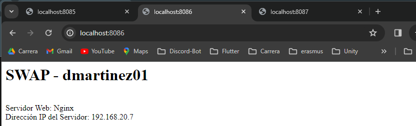

Para el servidor de **Lighttpd**:

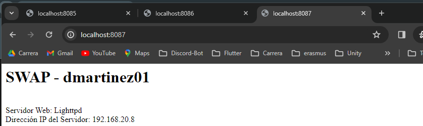

#### **Análisis propuesta IA**

Los resultados obtenidos de la IA me recomiendan tener por separados los Dockerfile de cada servidor web que deseo utilizar (en mi caso solo tengo configurado 1 para los servidores de Apache), donde solo me ha especificado que me construirá un servidor de Nginx.

Y me ha generado el siguiente Dockerfile:

```sh
# Utiliza una imagen base de Nginx
FROM nginx:latest

# Copia el contenido del directorio "html" local al directorio donde Nginx sirve los archivos estáticos
COPY ./html /usr/share/nginx/html

# Expone el puerto 80 para que pueda ser accesible desde fuera del contenedor
EXPOSE 80

# Comando por defecto para iniciar Nginx cuando se ejecute el contenedor
CMD ["nginx", "-g", "daemon off;"]
```

El Dockerfile generado por la IA para el servidor Nginx es bastante claro y directo. Utiliza la imagen base más reciente de Nginx disponible en Docker Hub y copia el contenido del directorio "html" local al directorio donde Nginx sirve los archivos estáticos dentro del contenedor. 

Además, expone el puerto 80 para permitir el acceso externo a los recursos servidos por Nginx y especifica el comando por defecto para iniciar Nginx cuando se ejecute el contenedor. Por lo que es una solución prácticamente similar a mi Dockerfile para los servidores de Apache.

Y me ha dicho de poner lo siguiente en el docker-compose.yml:

```yml
php-fpm:
    image: php:7.4-fpm
    volumes:
      - ./web_dmartinez01:/var/www/html
    networks:
      red_web:
        ipv4_address: 192.168.10.10

  nginx:
    image: nginx:latest
    volumes:
      - ./config/nginx/default.conf:/etc/nginx/conf.d/default.conf
      - ./web_dmartinez01:/var/www/html
    depends_on:
      - php-fpm
    environment:
      - SERVER_SOFTWARE=Nginx
    networks:
      red_web:
        ipv4_address: 192.168.10.7
    ports:
      - "8086:80"
```

Donde se puede ver que también que me ha creado un servicio **"php-fpm"**, el cual sirve para procesar los archivos PHP de manera dinámica. Los servidores web Nginx y Lighttpd están configurados para redirigir las solicitudes de archivos PHP a este servicio.

Esta solución es bastante correcta ya que busca una arquitectura modular y eficiente que sirve para conseguir más escalabilidad en la granja web, en cambio, mi propuesta es bastante simple donde no he implementado nuevos componentes y archivos "innecesarios" para este momento. Puede que en un futuro no muy lejano si sean de utilidad dichas implementaciones.

Por lo que podemos concluir que la solución de la IA es mucho más compleja que la propuesta, ya que implementa un nuevo servicio con sus respectivos archivos de configuración para redirigir hacia el php-fpm.

---
<div style="page-break-after: always;"></div>

### **Tareas Avanzadas - A3. Gestión Avanzada de Redes:**

Para implementar restricciones de acceso y reglas de enrutamiento específicas entre las dos redes, **red_web y red_servicios,** voy a necesitar instalarme nuevas herramientas para establecer dichas reglas o firewalls a nivel de red.

Para ello puedo hacer uso del comando **iptables**, que es una herramienta potente para configurar el firewall en Linux. Voy a realizar un par de ejemplos de cómo utilizar esta herramienta, en primer lugar, vamos a bloquear todo el tráfico de red_web a red_servicios.

Primero, es necesario identificar las redes de Docker involucradas. Esto se hace mediante el comando docker network ls, que lista todas las redes disponibles en el entorno Docker:

```bash
SWAP/Practicas/Practica1 on  main
❯ docker network ls
NETWORK ID     NAME                      DRIVER    SCOPE
682eb05ce376   backend_default           bridge    local
7e89711395d8   bridge                    bridge    local
d5d443c3993f   host                      host      local
73b6883abd78   none                      null      local
121cb7a4080f   practica1_red_servicios   bridge    local
98e3b1dd2a07   practica1_red_web         bridge    local
```

Una vez tenemos localizadas las redes, podemos hacer uso de los comandos de iptables, y como decía voy a bloquear todo el tráfico de red_web a red_servicios:

```bash
SWAP/Practicas/Practica1 on  main
❯ sudo iptables -A FORWARD -s 192.168.10.0/24 -d 192.168.20.0/24 -j DROP 
```

Y también voy a bloquear el tráfico de red servicios a red web a través de este otro comando:

```bash
SWAP/Practicas/Practica1 on  main
❯ sudo iptables -A FORWARD -s 192.168.20.0/24 -d 192.168.10.0/24 -j DROP
```

¿Como indicamos esto? 

Pues la opción **-A FORWARD** sirve para indicar que dicha regla se aplicará a los paquetes que se están reenviando a través del sistema, es decir, los que no provienen del propio sistema. Con la opción **-s** indicamos la dirección IP origen y con la opción **-d** la dirección IP del destino.

Y, por último, con la opción **-j DROP** es la opción que se realizará si el paquete enviado coincide con las condiciones establecidas previamente, en nuestro caso, lo que hará será descartar dichos paquetes o bloquearlos.

Estas reglas solo estarán en funcionamiento mientras no se reinicie en mi caso la WSL, pero si quisiésemos  hacerlas permanentes podríamos utilizar el comando **iptables-persistent**, pero por el momento no creo que sea necesario.

Para ver que las reglas están en funcionamiento, podemos utilizar el comando **iptables -L -v**, con el que nos listará las reglas activas con su respectiva información:

```bash
SWAP/Practicas/Practica1 on  main
❯ sudo iptables -L -v

Chain INPUT (policy ACCEPT 0 packets, 0 bytes)  
 pkts bytes target     prot opt in     out     source               destination

Chain FORWARD (policy ACCEPT 0 packets, 0 bytes)
 pkts bytes target     prot opt in     out     source               destination
    0     0 DROP       all  --  any    any     192.168.10.0/24      192.168.20.0/24
    0     0 DROP       all  --  any    any     192.168.20.0/24      192.168.10.0/24
```

Y vemos que tenemos las reglas que hemos añadido. Pero para hacer una comprobación más evidente vamos a bloquear el acceso al puerto 80, que es el de las peticiones HTTP para restringir el acceso a la página web. 

De primeras, no estamos restringiendo dicho acceso, como podemos ver utilizando el comando **curl**:

```bash
root@063c1d47b90d:/var/www/html# curl http://192.168.10.7
<h1>SWAP - dmartinez01</h1> <br>Servidor Web: Nginx<br>Dirección IP del Servidor: 192.168.20.7
```

Pero si añadimos este comando:

```bash
SWAP/Practicas/Practica1 on  main took 26s     
❯ sudo iptables -A FORWARD -p tcp -d 192.168.10.9 --dport 80 -j DROP
```

Con esto lo que estamos haciendo es crear una regla al firewall para bloquear el tráfico TCP destinado al puerto 80 (usualmente utilizado para HTTP) hacia la dirección IP específica 192.168.10.9. 

Y probamos a conectarnos con una petición vemos que ahora el acceso está bloqueado y no podemos conectarnos:

```bash
SWAP/Practicas/Practica1 on  main
❯ curl http://192.168.20.7
curl: (28) Failed to connect to 192.168.20.7 port 80: Connection timed out
```

#### **Análisis propuesta IA**

En cuanto al análisis vamos a ir comentando paso por paso cada parte de la IA con mi propuesta, en primer lugar la inteligencia artificial me sugiere una consideración más amplia sobre qué tipo de tráfico se desea permitir o restringir, sin especificar inicialmente las herramientas a utilizar.

Luego me indica la necesidad de asegurarse de que los contenedores tengan instaladas las herramientas necesarias para configurar el enrutamiento o las restricciones, modificando también el dockerfile:

```sh
# Definimos la imagen base como php:7.4-apache
FROM php:7.4-apache

# Actualizamos e instalamos herramientas de monitoreo y iptables
RUN apt-get update && \
    apt-get install -y iputils-ping net-tools htop apache2-utils iptables && \
    apt-get clean && \
    rm -rf /var/lib/apt/lists/*

# Copiamos archivos de configuración personalizados
COPY ./config/apache2.conf /etc/apache2/apache2.conf
COPY ./config/security.conf /etc/apache2/conf-available/security.conf
COPY ./config/php.ini-production /usr/local/etc/php/php.ini

# Copiamos el contenido de la carpeta 'web_dmartinez01' a '/var/www/html/'
COPY ./web_dmartinez01/ /var/www/html/

# Exponemos el puerto 80
EXPOSE 80

# Configuración de reglas de enrutamiento o restricciones de acceso
# Aquí puedes agregar comandos de iptables para configurar las reglas de firewall según tus necesidades
# Por ejemplo, permitir el tráfico HTTP desde la red red_web hacia el contenedor
RUN iptables -A INPUT -s 192.168.10.0/24 -p tcp --dport 80 -j ACCEPT

# Inicia el servidor Apache al iniciar el contenedor
CMD ["apache2-foreground"]
```

Donde una clara diferencia con mi propuesta es la persistencia de las reglas, que es verdad que se reinician cuando se apaga la wsl o los contenedores, sin embargo, al tener dicho comando en el mismo dockerfile se ejecutan dichas reglas cada vez que se quieran montar los contenedores por lo que siempre estarán presentes.

Luego la IA me recomienda que pruebe la conectividad para asegurar que las reglas de enrutamiento o restricciones estén funcionando como se espera, pero no profundiza en cómo lograrlo, por lo que en este caso yo profundizo más que esta.

A modo de conclusión, podemos decir que la IA invita a una planificación más detallada y considera la configuración de reglas dentro de los propios contenedores. Pero por otro lado, yo ofrezco un enfoque práctico y directo para implementar restricciones de acceso usando iptables.

Por lo que podemos decir, que ambas soluciones son acertadas, donde la suya tiene el punto fuerte de configurar las reglas dentro de los propios contenedores.


---
<div style="page-break-after: always;"></div>

### **Tareas Avanzadas - A4. Automatización con Scripts:**

Una vez que hemos configurado todo el proyecto de manera manual, es hora de hacernos la vida más cómoda intentando automatizar todo lo que podamos. Por tanto, lo primero que voy a hacer es crearme una carpeta **"scripts"** donde guardaré todos mis scripts:

```bash
Practicas/Practica1/Practica1 on  main
❯ mkdir scripts
```

Y voy a ir empezando a crearme los scripts, lo primero será crearme el archivo **"setup.sh"**, que se encargará de la limpieza de logs, chequeo de salud de los contenedores y actualizaciones automáticas de paquetes y que se encargará de automatizar el proceso de levantar los contenedores y configurar la red necesaria para ellos:

```sh
#!/bin/bash

# Función para levantar y construir contenedores
configurar_contenedores() {
    # Construye y levanta los contenedores utilizando docker-compose
    echo "Construyendo y levantando contenedores..."
    docker-compose up --build -d
    echo "Contenedores levantados y configuración de red realizada."
}

# Función para limpiar logs antiguos
limpiar_logs() {
    # Limpia los logs dentro de los contenedores que tienen más de 7 días de antigüedad
    echo "Iniciando limpieza de logs dentro de los contenedores..."
    for contenedor in $(docker ps --format "{{.Names}}"); do
        # Comprueba si el contenedor tiene bash antes de intentar ejecutar el comando
        if docker exec $contenedor which bash > /dev/null; then
            docker exec $contenedor bash -c 'find /var/log -type f -name "*.log" -mtime +7 -exec rm -f {} \;'
        else
            echo "El contenedor $contenedor no tiene bash, saltando limpieza de logs."
        fi
    done
    echo "Limpieza de logs completada."
}

# Función para chequear la salud de los contenedores
verificar_salud() {
    # Verifica si los contenedores están en ejecución
    echo "Iniciando chequeo de salud de los contenedores..."
    # Lista de contenedores a verificar
    contenedores=("practica1-web1-1" "practica1-web2-1" "practica1-web3-1" "practica1-web4-1" "practica1-web5-1" "practica1-web6-1" "practica1-web7-1" "practica1-web8-1")

    for contenedor in "${contenedores[@]}"; do
      # Verifica el estado de cada contenedor
      if [ "$(docker inspect --format='{{.State.Running}}' $contenedor)" != "true" ]; then
        echo "Alerta: El contenedor $contenedor no está corriendo."
      fi
    done
    echo "Chequeo de salud completado."
}

# Función para actualizar paquetes dentro de los contenedores
actualizar_paquetes() {
    # Actualiza los paquetes dentro de los contenedores
    echo "Iniciando actualización de paquetes dentro de los contenedores..."
    # Para contenedores basados en Debian/Ubuntu
    for contenedor in $(docker ps --format "{{.Names}}"); do
        # Comprueba si el contenedor tiene apt-get antes de intentar ejecutar el comando
        if docker exec $contenedor which apt-get > /dev/null; then
            docker exec $contenedor bash -c 'apt-get update && apt-get upgrade -y'
        else
            echo "El contenedor $contenedor no soporta apt-get, saltando actualización de paquetes."
        fi
    done
    echo "Actualización de paquetes completada."
}

# Ejecutar las funciones
configurar_contenedores
limpiar_logs
verificar_salud
actualizar_paquetes
```

En cuanto al funcionamiento de este script bash, podemos decir que automatiza tareas de gestión de contenedores Docker. La función **configurar_contenedores** levanta y construye los contenedores usando docker-compose, mientras que **limpiar_logs** elimina logs antiguos dentro de los contenedores. 

La función **verificar_salud** verifica si los contenedores están en ejecución y **actualizar_paquetes** actualiza los paquetes dentro de ellos. 

Y si ejecutamos dicho script, podemos ver cómo se van realizando todas las funciones de manera automática:

```bash
Practicas/Practica1/Practica1 on  main
❯ ./scripts/setup.sh
Construyendo y levantando contenedores...
[+] Building 1.8s (11/11) FINISHED
 => [internal] load build definition from DockerfileApache_dmartinez01  0.1s
 => => transferring dockerfile: 50B                                     0.0s
 => [internal] load .dockerignore                                       0.1s
 => => transferring context: 2B                                         0.0s
 => [internal] load metadata for docker.io/library/php:7.4-apache       1.3s
 => [1/6] FROM docker.io/library/php:7.4-apache@sha256:c9d7e608f738326  0.0s
 => [internal] load build context                                       0.1s
 => => transferring context: 232B                                       0.0s
 => CACHED [2/6] RUN apt-get update &&     apt-get install -y iputils-  0.0s
 => CACHED [3/6] COPY ./config/apache2.conf /etc/apache2/apache2.conf   0.0s
 => CACHED [4/6] COPY ./config/security.conf /etc/apache2/conf-availab  0.0s
 => CACHED [5/6] COPY ./config/php.ini-production /usr/local/etc/php/p  0.0s
 => CACHED [6/6] COPY ./web_dmartinez01/ /var/www/html/                 0.0s
 => exporting to image                                                  0.2s
 => => exporting layers                                                 0.0s 
 => => writing image sha256:9efd385444398b6885db1c3da200da252d0d33b3d7  0.0s
 => => naming to docker.io/library/dmartinez01-apache-image:p1          0.0s 
[+] Running 10/10
 ⠿ Network practica1_red_servicios  Created                             0.1s 
 ⠿ Network practica1_red_web        Crea...                             0.1s
 ⠿ Container practica1-web6-1       Sta...                              2.7s 
 ⠿ Container practica1-web2-1       Sta...                              4.6s 
 ⠿ Container practica1-web7-1       Sta...                              4.6s 
 ⠿ Container practica1-web8-1       Sta...                              4.0s 
 ⠿ Container practica1-web5-1       Sta...                              4.7s 
 ⠿ Container practica1-web1-1       Sta...                              2.5s 
 ⠿ Container practica1-web4-1       Sta...                              4.4s 
 ⠿ Container practica1-web3-1       Sta...                              3.0s 
Contenedores levantados y configuración de red realizada.
Iniciando limpieza de logs dentro de los contenedores...
Limpieza de logs completada.
Iniciando chequeo de salud de los contenedores...
Chequeo de salud completado.
Iniciando actualización de paquetes dentro de los contenedores...
Actualización de paquetes completada.
```
Podemos ver que tenemos todos los contenedores perfectos y en funcionamiento:

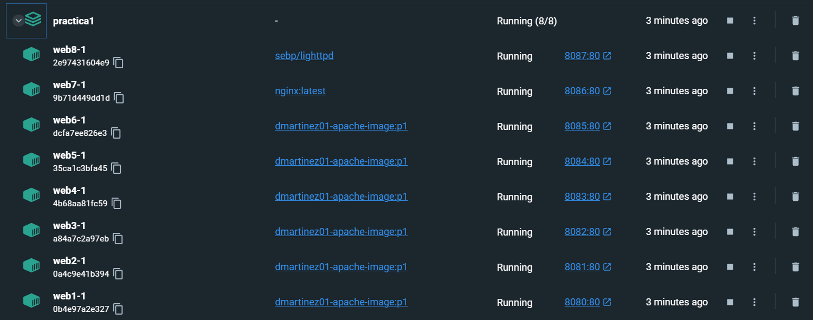

#### **Análisis propuesta IA**

Para este apartado, creo que la inteligencia artificial ha dado un resultado bastante escueto y no se ha ido mucho por las ramas, me ha generado varios scripts independientes para realizar las funciones propuestas en este apartado.

En primer lugar, me ha creado el script **"clean_logs.sh"**:

```sh
#!/bin/bash

# Limpieza de logs en contenedores Docker
# Este script asume que tus logs están en una ubicación estándar. Ajusta las rutas según sea necesario.

# Encuentra y elimina logs mayores a 7 días
find /var/log -type f -name '*.log' -mtime +7 -exec rm -f {} \;

echo "Limpieza de logs completada."
```

En mi caso yo he utilizado un bucle for para iterar sobre los contenedores en ejecución obtenidos mediante el comando docker ps y luego ya limpio los logs.

Sin embargo, a diferencia de mi función de limpiar logs, la implementación generada por la IA es más directa. Simplemente busca y elimina los archivos de log en el directorio /var/log que tengan más de 7 días de antigüedad.

Luego me ha creado el archivo **"update_packages.sh"**:

```sh
#!/bin/bash

docker exec -it <nombre_del_contenedor> apt-get update && docker exec -it <nombre_del_contenedor> apt-get upgrade -y

echo "Actualización de paquetes completada."
```

En este caso si podemos ver que el resultado es bastante más pobre, ya que no me implementa un script funcional, ya que tampoco tiene en cuenta los contenedores que se montan y se debería de poner un único de id del contenedor por lo que esta solución es bastante inútil.

En cambio, la que yo he propuesto si es funcional y eficaz, aunque el único inconveniente que le veo es el tiempo de espera, ya que va contenedor por contenedor actualizando los paquetes.

Por último, me ha creado el archivo **"setup_containers.sh"**:

```sh
#!/bin/bash

# Levanta los servicios definidos en docker-compose.yml
docker-compose up -d

echo "Contenedores creados y configurados."
```

La verdad que esta solución tampoco tiene mucho misterio, simplemente monta los servicios y ya. En mi caso, los construyo de nuevo, cada vez que lo ejecuto con la opción **--build**, porque siempre me quiero asegurar que todo lo nuevo esta actualizado para que no se escape ningún detalle.

Como conclusión, pordríamos decir que la solución propuesto por la IA deja mucho que desear y que le falta profundizar bastante más en cada sección o puede que haya sido mi culpa por no darle sufieciente contexto de la situación. Pero a fin de cuentas, el resultado que yo he proporcionado lo veo más rentable y eficiente en cuestión de automatización de los comandos necesarios para montar la granja correctamente.

---
<div style="page-break-after: always;"></div>

### **Tareas Avanzadas - A5. Monitoreo y Logging:**

Como última tarea propuesta, debemos realizar algunas tareas de monitoreo y logs para nuestros contenedores, para ello tendremos que hacer uso de herramientas que se recomiendan en el guión de prácticas, como pueden ser htop, netstat (parte del paquete net-tools), y apache2-utils para apache2ctl.

Para poder utilizar dichas herramientas, tendremos que modificar el Dockerfile para incluirlas:

```sh
# Definimos la imagen base como php:7.4-apache
FROM php:7.4-apache

# Actualizamos e instalamos herramientas de monitoreo
RUN apt-get update && \
    apt-get install -y iputils-ping net-tools htop apache2-utils && \
    apt-get clean && \
    rm -rf /var/lib/apt/lists/*

# Copiamos archivos de configuración personalizados
# Aquí estamos tomando nuestros propios archivos de configuración y los colocamos en las ubicaciones adecuadas en el contenedor.
COPY ./config/apache2.conf /etc/apache2/apache2.conf
COPY ./config/security.conf /etc/apache2/conf-available/security.conf
COPY ./config/php.ini-production /usr/local/etc/php/php.ini

# Copiamos el contenido de la carpeta 'web_dmartinez01' a '/var/www/html/'
COPY ./web_dmartinez01/ /var/www/html/

# Exponemos el puerto 80
EXPOSE 80
```

Una vez hemos instalado las herramientas de monitoreo, ya somos capaces de levantar los servicios con setup.sh y empezar a probar las nuevas herramientas.

Por ejemplo, empezamos con el comando **htop**, que sirve para ver el uso de recursos en tiempo real dentro del contenedor Apache:

```bash
Practicas/Practica1/Practica1 on  main took 14s
❯ docker exec -it practica1-web1-1 htop
```

Se nos mostrará lo siguiente:

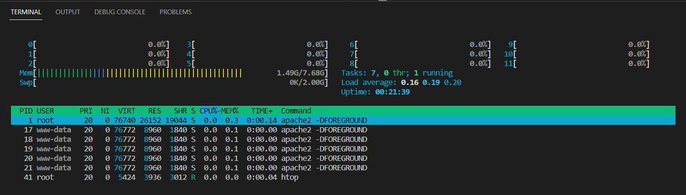

En la imagen podemos ver un encabezado, donde se muestran barras referenciando el uso de CPU, memoria RAM y SWAP (como lo asignatura). A la derecha podemos ver en azul clarito el **"load average"** que muestra el promedio de la carga del sistema en distintos periodos, 1, 5 y 15 minutos respectivamente.

Y ya abajo se ve un listado de procesos, con su prioridad, el usuario que inició el proceso y diferentes variables para representar la carga, como puede ser el uso de memoria virtual, el porcentaje de uso de la CPU y de la memoria... etc.

Por otro lado, también podemos utilizar el comando **netstat** que sirve para listar los puertos en escucha dentro del contenedor Apache.


```bash
Practicas/Practica1/Practica1 on  main took 1m9s
❯ docker exec -it practica1-web1-1 netstat -tuln
Active Internet connections (only servers)
Proto Recv-Q Send-Q Local Address           Foreign Address         State
tcp        0      0 127.0.0.11:42421        0.0.0.0:*               LISTEN
tcp        0      0 0.0.0.0:80              0.0.0.0:*               LISTEN
udp        0      0 127.0.0.11:33026        0.0.0.0:*
```
En la salida podemos ver las conexiones de red activas en el contenedor web1, que podemos mencionar la conexión TCP en el puerto 80, que también está escuchando en todas las direcciones IP disponibles en el contenedor, y que se utiliza para servicios web.

Y por último, podemos utilizar el comando **apache2ctl** para ver la configuración de los sitios de Apache y comprobar errores de configuración:

```bash
Practicas/Practica1/Practica1 on  main
❯ docker exec -it practica1-web1-1 apache2ctl -S
VirtualHost configuration:
*:80                   localhost (/etc/apache2/sites-enabled/000-default.conf:1)
ServerRoot: "/etc/apache2"
Main DocumentRoot: "/var/www/html"
Main ErrorLog: "/var/log/apache2/error.log"
Mutex default: dir="/var/run/apache2/" mechanism=default
Mutex mpm-accept: using_defaults
Mutex watchdog-callback: using_defaults
PidFile: "/var/run/apache2/apache2.pid"
Define: DUMP_VHOSTS
Define: DUMP_RUN_CFG
User: name="www-data" id=33
Group: name="www-data" id=33
```

Con la información que nos muestra el comando podemos concluir que hay un VirtualHost configurado para escuchar en todas las direcciones IP en el puerto 80, con el nombre de host localhost.

Además, se indica su configuración detallada en el archivo /etc/apache2/sites-enabled/000-default.conf y se proporcionan detalles adicionales sobre la configuración del servidor Apache, como la raíz del servidor.

No obstante, tomando inspiración de la tarea avanzada 4, voy a implementar un script para automatizar la ejecución de dichos comandos y poder ver los logs de los contenedores. Este es el código implementado en el archivo **monitoreo.sh**:

```sh
#!/bin/bash

# Defino los nombres de mis contenedores Apache, Nginx y Lighttpd
apache_containers=("practica1-web1-1" "practica1-web2-1" "practica1-web3-1" "practica1-web4-1" "practica1-web5-1" "practica1-web6-1")
nginx_containers=("practica1-web7-1")
lighttpd_containers=("practica1-web8-1")

# Función para monitorear el uso de recursos usando el comando top
monitorear_uso_recursos() {
  # Itero sobre los contenedores Apache
  for contenedor in "${apache_containers[@]}"; do
    echo "Monitoreando uso de recursos en $contenedor"
    # Ejecuto el comando top dentro del contenedor Apache actual
    docker exec -it $contenedor top -b -n 1
  done
}

# Función para verificar los puertos abiertos usando el comando netstat
chequear_puertos() {
  # Itero sobre los contenedores Apache
  for contenedor in "${apache_containers[@]}"; do
    echo "Puertos abiertos en $contenedor"
    # Ejecuto el comando netstat dentro del contenedor Apache actual
    docker exec -it $contenedor netstat -tuln
  done
}

# Función para verificar la configuración de Apache usando el comando apache2ctl
verificar_configuracion_apache() {
  # Itero sobre los contenedores Apache
  for contenedor in "${apache_containers[@]}"; do
    echo "Verificando configuración de Apache en $contenedor"
    # Ejecuto el comando apache2ctl dentro del contenedor Apache actual para mostrar la configuración
    docker exec -it $contenedor apache2ctl -S
  done
}

# Función para mostrar los últimos logs de acceso y error de Nginx y Lighttpd
mostrar_logs() {

  # Itero sobre los contenedores Apache
  for contenedor in "${apache_containers[@]}"; do
    echo "Guardando últimos logs de Apache del contenedor $contenedor"
    # Guardo los últimos 100 registros de los logs de Apache en un archivo
    docker logs $contenedor 2>&1 | tail -n 100 > "./logs/${contenedor}_combined.log"
  done

  # Itero sobre los contenedores Nginx
  for contenedor in "${nginx_containers[@]}"; do
    echo "Guardando últimos logs de Nginx del contenedor $contenedor"
    # Guardo los últimos 100 registros de los logs de Nginx en un archivo
    docker logs $contenedor 2>&1 | tail -n 100 > "./logs/${contenedor}_combined.log"
  done

  # Itero sobre los contenedores Lighttpd
  for contenedor in "${lighttpd_containers[@]}"; do
    echo "Guardando últimos logs de Lighttpd del contenedor $contenedor"
    # Guardo los últimos 100 registros de los logs de Lighttpd en un archivo
    docker logs $contenedor 2>&1 | tail -n 100 > "./logs/${contenedor}_combined.log"
  done
}

# Ejecutar las funciones definidas anteriormente
monitorear_uso_recursos
chequear_puertos
verificar_configuracion_apache
mostrar_logs
```

Y este sería el resultado obtenido:

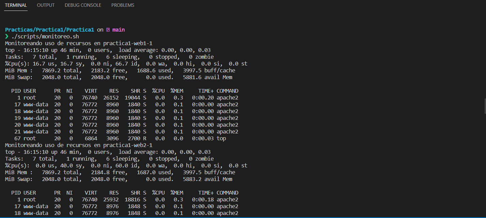

Además, almaceno los logs de los contenedores en una carpeta **./logs** para poder acceder a su información relativamente rápido:

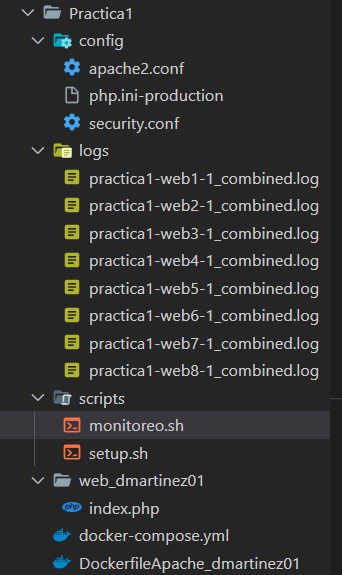

---

#### **Análisis propuesta IA**

Como último análisis sobre la inteligencia artificial, veremos paso a paso que me ha recomendado hacer, en este caso me ha sugerido que identifique las herramientas necesarias para monitorear los contenedores y me ha sugerido algunos de ellos:

```
Identificar herramientas necesarias:

Para monitorear el rendimiento del sistema, instalaré sysstat.
Para rotar y comprimir archivos de log, agregaré logrotate.
Configuraré los logs de Apache para que registren información detallada sobre las solicitudes HTTP y los errores del servidor.
```

Vemos que las herramientas que ha utilizado la IA son diferentes que las del guión de prácticas, y utiliza **sysstat y logrotate**. Pienso que los que yo he utilizado dan una visión más completa sobre lo que está ocurriendo dentro de los contenedores y ayudan más a la hora de detectar cualquier anomalía.

Me dice que actualice mi dockerfile para agregar las herramientas necesarias:

```sh
RUN apt-get update && \
    apt-get install -y iputils-ping net-tools sysstat logrotate && \
    apt-get clean && \
    rm -rf /var/lib/apt/lists/*
```

Y simplemente me comenta que reconstruya las imágenes y ejecute de nuevo los contenedores:

```bash
docker-compose build
docker-compose up -d
```

Y para configurar las herramientas y utilizarlas reallizará lo siguiente:

```
Accederé a los contenedores individualmente y comenzaré a utilizar las herramientas instaladas. 

Por ejemplo:
- Usaré htop para monitorear el uso de recursos del sistema.
- Utilizaré tail para seguir en tiempo real los archivos de log.
- Analizaré los logs de Apache para obtener información sobre las solicitudes HTTP y los errores del servidor.

```

Y a modo de conclusión sobre las diferencias entre ambas alternativas, puedo decir que la mía se centra en las herramientas propuestas en el guión como **htop, netstat, y apache2ctl.** Esta aproximación nos permite obtener una visión instantánea del estado actual del contenedor y reaccionar rápidamente a cualquier problema que se presente.

Además, al automatizar estos procesos mediante un script **monitoreo.sh**, aumentamos la eficiencia y simplificamos el proceso de mantener la salud del sistema.

Por otro lado, la IA sugiere una aproximación ligeramente diferente, recomendando herramientas como sysstat y logrotate, que son igualmente útiles para el monitoreo del rendimiento y la gestión de logs. Sin embargo, la recomendación de la IA no incluye una automatización inmediata ni un análisis en tiempo real tan directo como el proporcionado por htop y netstat. 

Por lo que a mi parecer, mi propuesta implementada es más acertada para hacer referencia al monitoreo de la granja web implementada.